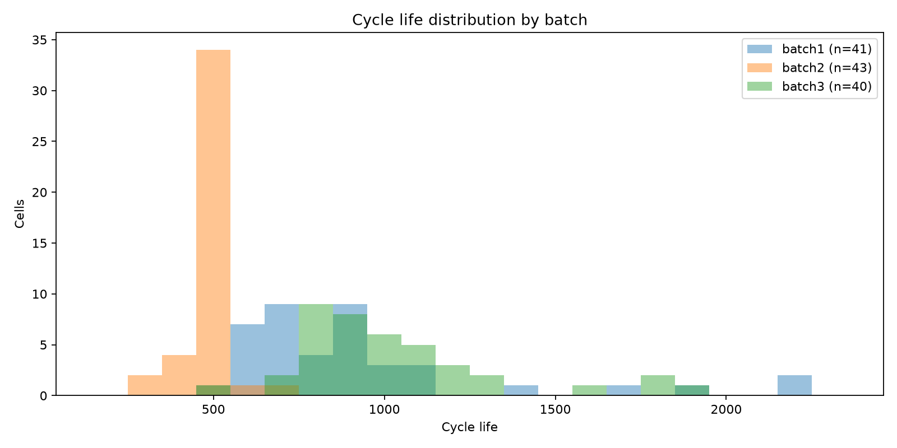
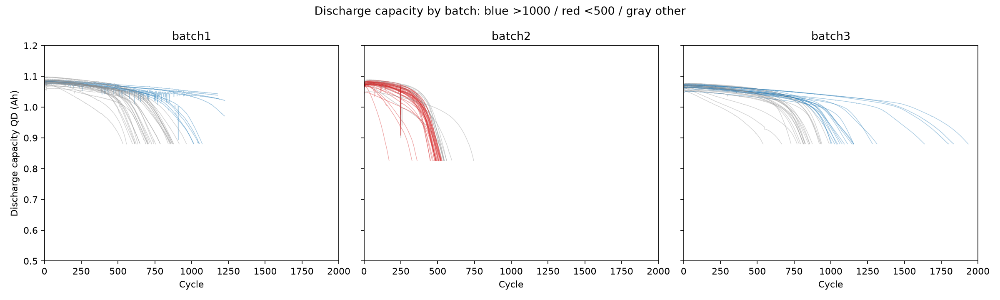
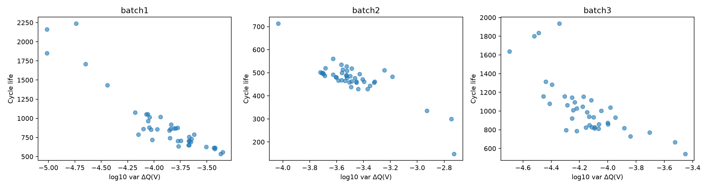
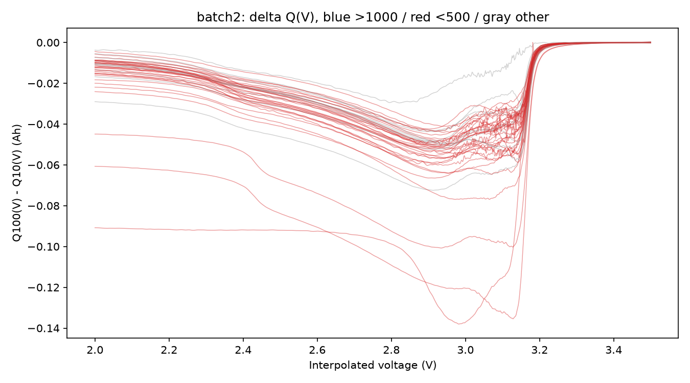
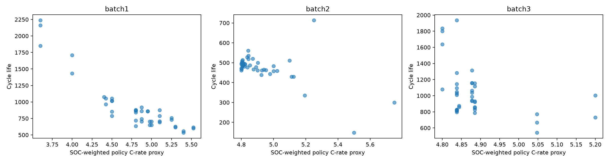
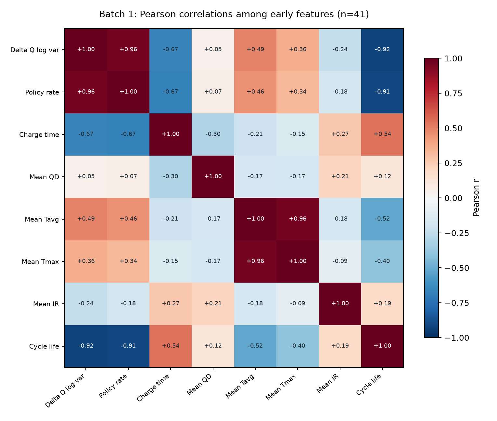
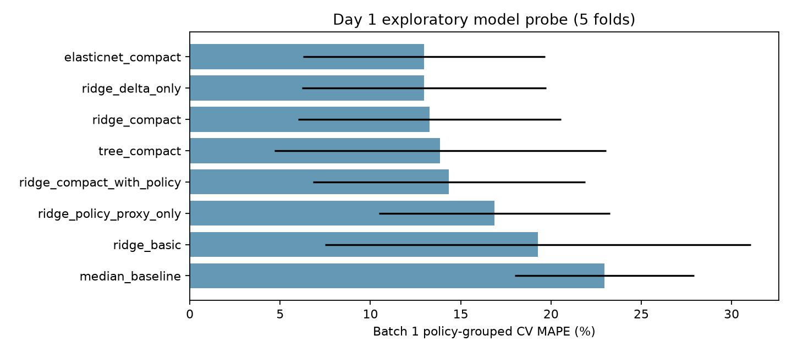

# DS, Mini Project : ESS 배터리 수명 예측 (DAY1)

**DS-MINI-Design · 울산 1반 · 박준형(U015) · 2026-10-01**

## 요약

- **목표와 데이터:** LFP·흑연 배터리 셀의 초기 100사이클로 80% 정격 용량에 도달할 때까지의 사이클 수를 예측합니다. 원논문의 Batch 1(2017-05-12), Batch 2(2017-06-30), Batch 3(2018-04-12)를 확인했고, 수명 분석에 **41·43·40셀**을 사용했습니다.
- **수명 분포:** 중앙값은 **842·481·965사이클**입니다. Batch 2의 43셀 중 **33셀(77%)**이 500사이클 미만이고, Batch 3의 40셀 중 **19셀(48%)**이 1,000사이클을 넘습니다. 같은 실험 데이터라는 이유로 배치별 수명 기준이 같다고 가정하지 않았습니다.
- **핵심 신호:** 100사이클과 10사이클의 방전 용량 곡선 차이 `ΔQ(V)`를 만들고 `log10 var(ΔQ(V))`를 계산했습니다. 수명과의 Spearman 상관은 세 배치에서 **-0.88·-0.65·-0.76**입니다. 초기 평균 방전 용량과 온도를 보조 변수로 선택했습니다.
- **충전 조건과 열화:** 충전 시간과 수명의 상관은 **0.60·0.04·0.05**로 Batch 1 밖에서는 약했습니다. 탐색적으로 구한 knee 중앙값은 **580·381·766사이클**이며 미래 기록을 쓰므로 입력 변수로 넣지 않았습니다. Batch 1의 연속 측정 5셀은 이어진 용량 곡선이 현재 파일에 없어 knee 계산에서 제외했습니다.
- **모델 전략:** Batch 1의 정책별 5분할 사전 비교에서 `ΔQ(V)`만 쓴 Ridge와 핵심 3변수 Elastic Net이 각각 약 **12.97% MAPE**, 핵심 3변수 Ridge는 **13.27%**, 중앙값 기준선은 **22.96%**였습니다. Day 2에는 Ridge 계열의 로그 타깃 변형을 포함해 후보를 비교하겠습니다. 최고 점수보다 변수의 측정 의미와 배치 간 이동을 함께 보겠습니다.
- **제 판단:** Batch 2의 최단 수명 **148사이클** 셀은 초기 `ΔQ(V)` 변화가 크지만, 짧아진 원인을 충전 정책 하나로 단정할 수 없습니다. 신호가 수명과 연결된다는 사실과 절대 수명을 정확히 예측한다는 사실을 구분하겠습니다.

## 목차

- ESS와 배터리 셀 (도메인 기반 변수 선택)
  - ESS가 배터리를 사용하는 이유 · 셀의 열화와 제가 고른 측정값 · 수명 기준과 충전 정책을 확인한 이유 · 셀 실험 결과를 ESS에 적용할 때의 한계
- 분석 목표와 데이터 구성
  - 분석 목표와 진행 순서 · 세 배치의 원본과 제외·보정 기준
- EDA: 수명 분포, 용량 열화, `ΔQ(V)`, 충전 조건
  - 1. 수명 분포와 짧은 수명 셀 · 2. 방전 용량과 knee · 3. 초기 `ΔQ(V)` 파생변수 · 4. 충전 정책과 수명 · 5. 상관관계와 중복 변수
- 변수 선정과 모델 전략
  - 입력 변수와 제외 근거 · 후보 모델과 사전 비교 · 검증 설계
- 시사점과 제 생각
  - 가설 변경과 기준 선정
- 참고 자료

## ESS와 배터리 셀 (도메인 기반 변수 선택)

### ESS가 배터리를 사용하는 이유

ESS는 남는 전력을 저장했다가 필요한 시점에 공급합니다. 태양광·풍력의 발전량이 달라질 때 공급을 보완하고, 전력 수요가 몰리는 시간의 피크를 줄이는 데 쓰입니다. [미국 에너지부의 에너지 저장 설명](https://www.energy.gov/oe/energy-storage-rdd)을 읽고 배터리 수명 예측의 용도를 생각했습니다. 용량이 예상보다 빨리 줄면 계획한 양의 전력을 공급하기 어렵고, 교체 시기를 지나치게 앞당기면 비용이 늘어납니다. **초기 수명 예측은 운영·교체 계획의 근거가 됩니다.**

ESS의 구성도 확인했습니다. [NREL의 상업·전력망용 저장 시스템 자료](https://docs.nrel.gov/docs/fy22osti/81408.pdf)에는 셀·모듈·팩·랙과 열 관리, 제어 장치, 전력변환 장치가 함께 나옵니다. 이번 데이터는 그중 **셀의 충방전 기록**입니다. 팩 내부의 셀 간 영향이나 냉각·제어 성능은 측정하지 않았습니다. 따라서 분석 결과는 ESS 전체의 실제 교체 주기를 뜻하지 않습니다.

### 셀의 열화와 제가 고른 측정값

이번 데이터의 셀은 **LFP(리튬인산철) 양극·흑연 음극** 조합이며 여러 빠른 충전 조건에서 시험됐습니다. [미국 에너지부의 배터리 작동 설명](https://www.energy.gov/science/doe-explainsbatteries)을 읽고 충방전 과정에서 이온과 전자가 이동하며 반복 사용에 따라 성능이 변한다는 점을 확인했습니다. 처음에는 방전 용량 `QD`로 수명을 구분하려 했습니다. 그러나 초기 용량은 셀 사이 차이가 작았습니다.

[Severson 등의 원논문](https://doi.org/10.1038/s41560-019-0356-8)은 초기 용량 저하가 뚜렷하지 않아도 방전 전압 곡선의 변화가 수명과 관련됨을 보였습니다. 이를 확인하기 위해 **같은 전압에서 100사이클의 방전 용량과 10사이클의 방전 용량을 뺀 `ΔQ(V)`**를 계산했습니다. 이후 곡선의 분산이 셀별 수명 차이를 드러내는지 세 배치에서 비교했습니다. 분산과 수명의 상관만으로 열화 원인을 단정하지는 않았습니다.

### 수명 기준과 충전 정책을 확인한 이유

`cycle_life`는 셀의 방전 용량이 **정격 용량의 80%**에 도달할 때까지의 사이클 수입니다. 시험 셀의 정격 용량은 1.1Ah이므로 1C는 1.1A입니다. [원논문의 실험 방법](https://web.mit.edu/braatzgroup/Severson_NatureEnergy_2019.pdf)에 따르면 SOC 0~80% 구간은 한두 단계의 C-rate로 충전하고, 80~100% 구간은 공통된 1C 방식으로 충전했습니다. 방전 조건은 모든 셀에서 같았습니다. 첫 구간 C-rate만 사용하면 전류가 바뀌는 시점과 두 번째 충전 단계가 빠집니다.

처음에는 첫 구간 C-rate와 충전 시간을 주요 변수로 생각했습니다. 충전 정책을 숫자 하나로 나타내기 어렵다는 점을 확인한 뒤, 셀에 나타난 초기 변화를 직접 보기로 했습니다. `Qdlin(V)`는 공통 방전 조건에서 기록한 곡선을 같은 전압에 맞춘 값입니다. 원논문처럼 **3.5~2.0V의 1,000개 전압점**에서 10사이클과 100사이클의 곡선을 비교했습니다. 이 분석은 초기 상태 변화와 수명의 관계를 보여 주며, 충전 정책의 인과 효과까지 입증하지는 않습니다.

### 셀 실험 결과를 ESS에 적용할 때의 한계

실제 ESS에는 셀 간 편차, 팩의 열 관리, 제어 방식이 더해집니다. 따라서 충전 시간이나 C-rate와 셀 수명의 상관을 ESS 운영 지침으로 바로 바꿀 수 없습니다. 저는 먼저 **세 배치에서 방향이 유지되는 초기 신호**를 찾았습니다. ESS 적용 가능성은 팩 단위 운전 데이터로 다시 검증해야 합니다.

## 분석 목표와 데이터 구성

### 분석 목표와 진행 순서

처음 100사이클에서 셀 사이의 수명 차이를 설명할 변수를 찾기 위해 **배치별 EDA → 변수 생성·선정 → Batch 1 내부 후보 비교 → Day 2 평가 전략** 순서로 진행했습니다. 목표값은 `cycle_life`의 사이클 수인 **회귀 문제**로 정했습니다. ESS의 점검·교체 시기를 생각할 때 장·단수명 분류만으로는 시점을 판단하기 어렵기 때문입니다. 이 값은 실험 셀의 수명이며 팩의 교체 시점은 별도 검증이 필요합니다.

### 세 배치의 원본과 제외·보정 기준

[원논문의 원자료](https://data.matr.io/1/projects/5c48dd2bc625d700019f3204) 중 `2017-05-12`, `2017-06-30`, `2018-04-12` 파일을 Batch 1·2·3으로 사용했습니다. 원본에는 각각 **46·48·46셀**이 있습니다. [공개 전처리 코드](https://github.com/rdbraatz/data-driven-prediction-of-battery-cycle-life-before-capacity-degradation/blob/master/Load%20Data.ipynb)에 따라 Batch 1에서 80% 용량 종료점에 도달하지 않은 5셀을 제외했습니다. Batch 1 첫 5셀은 Batch 2에 이어 기록된 길이 **662·981·1,060·208·482사이클**을 각각 수명값에 더하고, 그 연속 기록 5셀은 Batch 2에서 제외했습니다. Batch 3의 노이즈 채널 6셀도 제외했습니다. 최종 수명 분석 표본은 **41·43·40셀**입니다.

이 처리는 셀을 새로 만들거나 수명을 추정한 것이 아닙니다. 원본의 두 시기에 걸친 동일 셀 기록을 공개 코드대로 연결한 것입니다. 다만 Batch 1의 원본 용량 곡선에는 이어진 구간이 없어 첫 5셀의 knee는 계산하지 않았습니다. 사이클별 기록을 그대로 표본으로 세면 장수명 셀이 더 많이 집계되므로 수명 분포와 상관관계는 **셀 한 개를 한 행**으로 계산했습니다. 기존에 다른 실험의 `2018-02-20` 파일을 Batch 2로 해석한 오류를 확인해, 이 문서의 모든 표와 그림은 공식 Batch 2로 다시 만들었습니다.

## EDA: 수명 분포, 용량 열화, `ΔQ(V)`, 충전 조건

### 1. 수명 분포와 짧은 수명 셀

| 배치 | 셀 수 | 평균 | 중앙값 | 범위 | 500 미만 | 1,000 초과 |
|---|---:|---:|---:|---:|---:|---:|
| Batch 1 | 41 | 921 | 842 | 534–2,237 | 0셀 | 10셀(24%) |
| Batch 2 | 43 | 473 | 481 | 148–713 | 33셀(77%) | 0셀 |
| Batch 3 | 40 | 1,032 | 965 | 541–1,935 | 0셀 | 19셀(48%) |

Batch 1에서 학습할 수 있는 가장 짧은 수명은 **534사이클**인데 Batch 2에는 500사이클 미만이 33셀입니다. Batch 1에서 학습한 절대 수명 기준을 Batch 2에 그대로 적용하면 짧은 셀을 길게 예측할 가능성이 있다고 생각했습니다. 반대로 Batch 3에는 1,000사이클 초과 셀이 많아, 두 테스트 배치가 같은 방식으로 어렵다고 볼 수 없습니다.

Batch 2에서 특히 짧은 셀은 **148·300·335사이클**입니다. Batch 2의 1.5×IQR 하한은 **404사이클**이므로 세 셀은 통계적 이상값입니다. 가장 짧은 `batch2_001`의 정책은 `2C(10%)-6C`이고 `ΔQ(V)` 로그 분산은 **-2.73**으로 배치 중앙값 **-3.52**보다 큽니다. 초기 곡선 변화가 크다는 관찰은 짧은 수명과 맞지만, 원인을 정책이나 특정 열화 기전 하나로 특정할 수 없습니다. 유효한 종료 기록이라 분석에서 임의로 빼지 않았습니다.

### 2. 방전 용량과 knee

방전 용량 `QD`는 초기에는 비슷하지만 뒤로 갈수록 하강 시점이 벌어집니다. 21사이클 이동 중앙값으로 곡선을 완만하게 만든 다음 두 구간 직선의 오차가 가장 작은 경계를 찾았습니다. 유효한 곡선은 Batch 1 **36개**, Batch 2 **43개**, Batch 3 **40개**이며 탐색적 knee 중앙값은 각각 **580·381·766사이클**입니다. 유효 곡선에서는 모두 뒤 구간의 감소 기울기가 더 가팔랐습니다. 따라서 용량 감소를 일정한 직선 하나로 설명하기 어렵습니다.

이 knee는 수명 후반 기록을 사용한 사후 설명 변수입니다. 초기 100사이클 예측에 넣으면 미래 정보를 미리 본 결과가 되므로 모델 입력에서 제외했습니다. 두 직선의 경계는 제가 정한 탐색 규칙이고 물리적 열화 기전의 시작점이라고 확정하지 않았습니다. Batch 1의 연속 측정 5셀은 이어진 용량 곡선이 현재 파일에 없어 이 계산에서 빠졌습니다.

### 3. 초기 `ΔQ(V)` 파생변수

초기 평균 방전 용량과 수명의 Spearman 상관은 Batch 1·2·3에서 **0.19·0.30·0.25**였습니다. 저는 시작 용량 하나보다 같은 전압에서 본 **10사이클과 100사이클 사이의 용량 변화**가 더 직접적인 초기 신호라고 생각했습니다. 각 셀의 `Qdlin100(V) - Qdlin10(V)` 곡선을 만들고, 그 분산에 `log10`을 취해 `delta_q_logvar`를 만들었습니다. `Qdlin`은 3.5~2.0V의 1,000개 공통 전압점으로 보간된 방전 곡선입니다.

`delta_q_logvar`와 수명의 Spearman 상관은 Batch 1 **-0.88**, Batch 2 **-0.65**, Batch 3 **-0.76**입니다. 변화가 큰 셀일수록 수명이 짧은 방향이 세 배치에서 유지됐습니다. 저는 이 변수의 **일관된 방향**을 중요하게 봤습니다. 다만 중앙값이 **-3.84·-3.52·-4.15**로 이동하므로 한 배치의 임계값이나 회귀식을 그대로 다른 배치에 적용할 근거는 아닙니다.

Batch 2에는 1,000사이클 초과 셀이 없습니다. 빨간 곡선은 500사이클 미만, 회색은 나머지 셀입니다. 한 배치 안에서 장수명(>1,000) 대 단수명(<500) 곡선을 직접 비교할 수 없으므로, 분산의 상관 방향은 배치별로 따로 확인했습니다. 곡선의 평균 절댓값도 수명과 연결됐지만 같은 원곡선에서 만든 값이라 중복될 수 있어 분산을 대표 변수로 골랐습니다.

### 4. 충전 정책과 수명

초기 평균 충전 시간과 수명의 Spearman 상관은 Batch 1 **0.60**, Batch 2 **0.04**, Batch 3 **0.05**입니다. 처음에는 긴 충전 시간이 긴 수명과 연결된다고 예상했지만, Batch 1 밖에서는 거의 관계가 없었습니다. 첫 구간 C-rate와 수명의 상관도 **-0.49·+0.14·-0.16**으로 일정하지 않습니다. 따라서 첫 단계의 속도를 셀 수명의 보편적 원인이나 안정적인 단일 입력으로 해석하지 않았습니다.

두 충전 단계를 함께 보려고 0~80% SOC 구간에서 각 단계의 길이로 C-rate를 가중한 **정책 강도 대리변수**를 만들었습니다. 예를 들어 `6C(60%)-3C`는 `(6×60+3×20)/80=5.25C`입니다. 이는 정책표의 숫자를 요약한 값이며 실제 평균 전류나 충전 시간을 측정한 값은 아닙니다. 이 변수와 수명의 상관은 **-0.85·-0.43·-0.43**입니다. Batch 1의 관계가 가장 강하지만 정책별 표본이 적고 배치 조건이 달라 충전 속도의 인과 효과라고 주장하지 않았습니다.

### 5. 상관관계와 중복 변수

| 초기 신호 | Batch 1 | Batch 2 | Batch 3 |
|---|---:|---:|---:|
| `log10 var(ΔQ(V))` | **-0.88** | **-0.65** | **-0.76** |
| 정책 강도 대리변수 | -0.85 | -0.43 | -0.43 |
| 첫 구간 C-rate | -0.49 | +0.14 | -0.16 |
| 초기 평균 충전 시간 | +0.60 | +0.04 | +0.05 |
| 초기 평균 `QD` | +0.19 | +0.30 | +0.25 |
| 초기 평균 `IR` | +0.21 | +0.10 | +0.21 |
| 초기 평균 `Tavg` | -0.39 | +0.09 | +0.02 |

Batch 1에서 정책 강도와 `ΔQ(V)` 로그 분산의 Pearson 상관은 **0.96**, `Tavg`와 `Tmax`는 **0.96**입니다. 정책 강도와 `ΔQ(V)`를 동시에 넣어 점수가 좋아져도 독립적인 기여라고 보기 어렵고, 두 온도 변수를 모두 넣을 이유도 약합니다. 히트맵은 Batch 1 **41셀의 Pearson 상관**, 위 표는 배치별 **Spearman 상관**으로 계산 방식이 다릅니다. 결측은 변수별로 확인했으며, 선택한 세 입력에는 분석 셀의 결측이 없었습니다.

## 변수 선정과 모델 전략

### 입력 변수와 제외 근거

| 변수 | 판단 | 결정 |
|---|---|---|
| `log10 var(ΔQ(V))` | 세 배치에서 수명과 일관된 음의 관계 | 핵심 파생변수로 선택했습니다. |
| 초기 평균 `QD` | 배치별 시작 용량 차이를 나타냄 | 보조 입력으로 시험했습니다. |
| 초기 평균 `Tavg` | 열 조건을 요약하되 수명 상관은 불안정 | 단독 근거로 쓰지 않고 보조 입력으로 시험했습니다. |
| 충전 정책 강도 | Batch 1에서는 강하나 `ΔQ(V)`와 중복 | 추가 후보로만 남겼습니다. |
| 충전 시간·`Tmax` | 배치 간 관계 불안정·온도 변수 중복 | 핵심 조합에서 제외했습니다. |
| knee·`cycle_life` | 수명 이후 또는 목표값 자체 | 예측 입력에서 제외했습니다. |

### 후보 모델과 사전 비교

Batch 1의 41셀을 충전 정책별 5분할로 나눠 같은 조건에서 모델과 변수 조합을 비교했습니다. 결측 대체와 표준화는 각 학습 폴드에서만 맞췄습니다. 이 단계의 점수는 **Batch 1 내부 개발 점수**입니다.

| 사전 비교 | Batch 1 CV MAPE | 제 해석 |
|---|---:|---|
| 중앙값 기준선 | 22.96% | 변수를 쓰지 않았을 때의 기준입니다. |
| 기본 변수 Ridge(QD·Tavg·충전 시간) | 19.28% | 충전 시간 중심 조합은 약했습니다. |
| `ΔQ(V)`만 사용한 Ridge | **12.97%** | 파생변수 하나로 기준선을 크게 낮췄습니다. |
| 정책 강도만 사용한 Ridge | 16.88% | `ΔQ(V)` 단독보다 높았습니다. |
| 핵심 3변수 Ridge | 13.27% | 보조 변수가 반드시 이득은 아니었습니다. |
| 핵심 3변수 + 정책 강도 Ridge | 14.35% | 중복 변수가 점수를 개선하지 않았습니다. |
| 핵심 3변수 Elastic Net | **12.97%** | Ridge와 비슷한 수준입니다. |
| 깊이 2 결정트리 | 13.86% | 이 표본에서 뚜렷한 이득이 없었습니다. |

제가 만든 `ΔQ(V)` 파생변수가 기본 변수만 쓴 Ridge의 **19.28%를 12.97%로 낮춘 점**을 확인했습니다. 세 변수를 추가했을 때 13.27%로 조금 높아진 결과도 숨기지 않았습니다. 이 표본만으로 보조 변수의 기여를 확정하기 어렵습니다. Day 2 후보에는 해석 가능한 Ridge·Elastic Net과 작은 트리, 수명 분포의 긴 꼬리와 MAPE를 고려한 **로그 타깃 Ridge**를 올리겠습니다. Random Forest·Gradient Boosting도 비교하되, 성능이 높다는 이유만으로 최종 모델을 정하지 않겠습니다.

### 검증 설계

Day 2에는 Batch 1을 **정책이 겹치지 않는 개발용과 hold-out**으로 나누고, 개발용 CV로 최종 설정을 선택하겠습니다. Hold-out과 Batch 2는 그 뒤에 평가합니다. 논문의 9.1%는 모델·분할이 달라 참고값으로 두고, Batch 2의 MAPE와 차이를 명시하겠습니다. Batch 3은 추가 평가로 두며 수명 분포와 충전 커브 시작점의 차이를 함께 보겠습니다. 특히 500사이클 미만의 과대예측과 1,000사이클 초과의 과소예측을 따로 확인하겠습니다.

## 시사점과 제 생각

### 가설 변경과 기준 선정

처음에는 빠른 충전이 수명을 짧게 만든다는 설명이 가장 쉬워 보였습니다. Batch 1에서는 정책 강도와 수명의 상관이 -0.85여서 설득력도 있었습니다. 그러나 Batch 2·3에서는 -0.43으로 약해졌고, 정책 강도와 `ΔQ(V)`는 Batch 1에서 0.96으로 겹쳤습니다. 저는 이 결과를 보고 **정책의 숫자 하나보다 셀에서 실제로 관측한 초기 곡선 변화**를 중심에 두기로 했습니다. 상관관계만으로 충전 조건의 원인 효과를 주장하지 않겠습니다.

수명 분포도 제 예상과 달랐습니다. 공식 Batch 2는 43셀 중 33셀이 500사이클 미만이고, Batch 3은 19셀이 1,000사이클을 넘습니다. 같은 `ΔQ(V)` 신호가 세 배치에서 수명과 같은 방향으로 연결돼도, 배치별 절대 수명 기준은 다를 수 있습니다. 저는 모델을 고를 때 내부 CV 점수뿐 아니라 **어느 배치에서, 어느 수명 구간을 얼마나 틀리는지**를 함께 보고 싶습니다. Day 2에 Batch 1만으로 선택한 모델을 Batch 2에 적용해 이 가정을 검증하겠습니다.

원자료 점검도 분석의 일부라는 점을 다시 배웠습니다. `2018-02-20` 파일을 공식 Batch 2로 잘못 해석하면 셀 수, 수명 분포, 모델 점수가 모두 바뀝니다. Batch 1의 5개 미종료 셀과 5개 연속 측정 셀도 대상 정의에 직접 영향을 줍니다. 저는 이후에는 그래프를 그리기 전에 **파일 날짜, 실험 배치, 셀 제외·연결 근거**부터 적고 확인하겠습니다.

## 참고 자료

- [MIT–Stanford 원자료](https://data.matr.io/1/projects/5c48dd2bc625d700019f3204): 세 배치 `.mat` 파일.
- [원논문 공개 코드](https://github.com/rdbraatz/data-driven-prediction-of-battery-cycle-life-before-capacity-degradation/blob/master/Load%20Data.ipynb): 연속 측정·제외 셀 처리.
- [Severson 외 원논문](https://doi.org/10.1038/s41560-019-0356-8): 실험 조건과 초기 `ΔQ(V)` 분석.
- [미국 에너지부 ESS 설명](https://www.energy.gov/oe/energy-storage-rdd), [NREL 저장 시스템 구성 자료](https://docs.nrel.gov/docs/fy22osti/81408.pdf), [미국 에너지부 배터리 작동 설명](https://www.energy.gov/science/doe-explainsbatteries): 도메인 이해.
