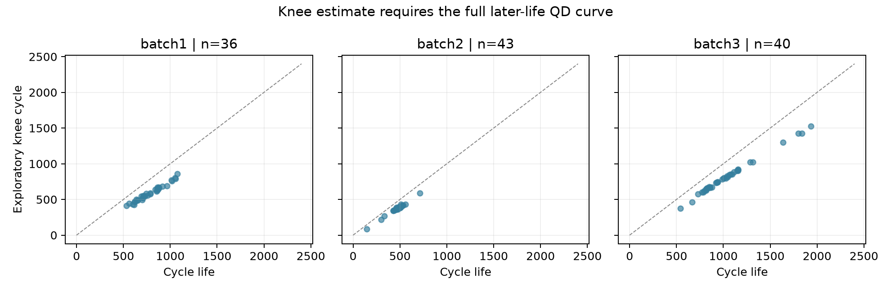

# DS, Mini Project : ESS 배터리 수명 예측 (DAY1)

**DS-MINI-Design · 울산 1반 · 박준형(U015) · 2026-10-02**

## 요약

- **분석 질문:** 초기 100사이클에서 얻은 정보로 셀의 수명(`cycle_life`)을 예측할 수 있는지 확인했습니다. 정답은 정격 용량의 80%에 도달할 때까지의 사이클 수입니다. 원논문의 Batch 1·2·3을 각각 **41·43·40셀**로 정리했고, 셀 하나를 분석 단위로 삼았습니다.
- **먼저 확인한 차이:** 세 배치 수명 중앙값은 **842·481·965사이클**입니다. Batch 2는 **33/43셀(77%)이 500사이클 미만**이고, Batch 3은 **19/40셀(48%)이 1,000사이클 초과**입니다. Batch 1에서 배운 절대 수명 기준을 다른 배치에 옮길 때 큰 오차가 날 수 있다는 가설을 세웠습니다.
- **가장 중요한 변수:** 10사이클과 100사이클의 전압별 방전 용량 차이 `ΔQ(V)`에서 `log10 var(ΔQ(V))`를 만들었습니다. 수명과의 Spearman 상관은 **-0.88·-0.65·-0.76**으로 세 배치에서 방향이 같습니다. 반면 초기 평균 방전 용량의 상관은 **0.19·0.30·0.25**였습니다. 저는 시작 용량보다 초기 곡선 변화에 우선순위를 두었습니다.
- **제외한 정보:** 후반 용량 곡선의 knee는 중앙값이 **580·381·766사이클**이었지만, 초기 예측 시점에는 알 수 없습니다. 충전 시간의 수명 상관도 **0.60·0.04·0.05**로 배치마다 달랐습니다. 두 값을 핵심 입력에서 제외하고 초기 평균 방전 용량·온도는 보조 후보로 남겼습니다.
- **모델 전략과 판단:** Batch 1 정책별 5분할 사전 비교에서 `ΔQ(V)` 단독 Ridge는 **12.97% MAPE**, 3변수 Ridge는 **13.27%**, 중앙값 기준선은 **22.96%**였습니다. 보조 변수를 추가해도 오차가 줄지 않았다는 결과를 그대로 반영했습니다. Day 2에는 로그 타깃 Ridge·Elastic Net·작은 트리 등을 비교하되, 선택 기준은 Batch 1 내부 점수와 배치 이동 위험을 함께 고려하겠습니다.

## 목차

- ESS와 배터리 셀 (도메인 기반 변수 선택)
  - ESS가 배터리를 사용하는 이유 · 셀의 열화와 제가 고른 측정값 · 수명 기준과 충전 정책을 확인한 이유 · 셀 실험 결과를 ESS에 적용할 때의 한계
- 분석 목표와 데이터 구성
  - 분석 목표와 진행 순서 · 세 배치의 원본과 제외·보정 기준
- EDA: 수명 분포, 용량 열화, `ΔQ(V)`, 충전 조건
  - 1. 수명 분포와 짧은 수명 셀 · 2. 방전 용량과 knee · 3. 초기 `ΔQ(V)` 곡선과 파생변수 · 4. 충전 정책과 수명 · 5. 상관관계와 중복 변수
- 변수 선정과 모델 전략
  - 회귀 목표와 입력 범위 · 입력 변수와 제외 근거 · 후보 모델 선정 근거 · 후보 모델 사전 비교 · 검증 설계
- 시사점과 제 생각
  - 가설 변경과 기준 선정 · 이 결과가 말하는 것 · 다음 확인 순서
- 참고 자료

## ESS와 배터리 셀 (도메인 기반 변수 선택)

### ESS가 배터리를 사용하는 이유

ESS는 남는 전력을 저장했다가 필요한 시점에 공급합니다. 태양광·풍력의 발전량이 달라질 때 공급을 보완하고, 전력 수요가 몰리는 시간의 피크를 줄이는 데 쓰입니다. [미국 에너지부의 에너지 저장 설명](https://www.energy.gov/oe/energy-storage-rdd)을 읽고 배터리 수명 예측의 용도를 생각했습니다. 용량이 예상보다 빨리 줄면 계획한 양의 전력을 공급하기 어렵고, 교체 시기를 지나치게 앞당기면 비용이 늘어납니다. **초기 수명 예측은 운영·교체 계획의 근거가 됩니다.**

ESS의 구성도 확인했습니다. [NREL의 상업·전력망용 저장 시스템 자료](https://docs.nrel.gov/docs/fy22osti/81408.pdf)에는 셀·모듈·팩·랙과 열 관리, 제어 장치, 전력변환 장치가 함께 나옵니다. 이번 데이터는 그중 **셀의 충방전 기록**입니다. 팩 내부의 셀 간 영향이나 냉각·제어 성능은 측정하지 않았습니다. 따라서 분석 결과는 ESS 전체의 실제 교체 주기를 뜻하지 않습니다.

### 셀의 열화와 제가 고른 측정값

이번 데이터의 셀은 **LFP(리튬인산철) 양극·흑연 음극** 조합이며 여러 빠른 충전 조건에서 시험됐습니다. [미국 에너지부의 배터리 작동 설명](https://www.energy.gov/science/doe-explainsbatteries)을 읽고 충방전 과정에서 이온과 전자가 이동하며 반복 사용에 따라 성능이 변한다는 점을 확인했습니다. 처음에는 방전 용량 `QD`로 수명을 구분하려 했습니다. 그러나 초기 용량은 셀 사이 차이가 작았습니다.

[Severson 등의 원논문](https://doi.org/10.1038/s41560-019-0356-8)은 초기 용량 저하가 뚜렷하지 않아도 방전 전압 곡선의 변화가 수명과 관련됨을 보였습니다. 이를 확인하기 위해 **같은 전압에서 100사이클의 방전 용량과 10사이클의 방전 용량을 뺀 `ΔQ(V)`**를 계산했습니다. 이후 곡선의 분산이 셀별 수명 차이를 드러내는지 세 배치에서 비교했습니다. 분산과 수명의 상관만으로 열화 원인을 단정하지는 않았습니다.

### 수명 기준과 충전 정책을 확인한 이유

`cycle_life`는 셀의 방전 용량이 **정격 용량의 80%**에 도달할 때까지의 사이클 수입니다. 시험 셀의 정격 용량은 1.1Ah이므로 1C는 1.1A입니다. [원논문의 실험 방법](https://web.mit.edu/braatzgroup/Severson_NatureEnergy_2019.pdf)에 따르면 SOC 0~80% 구간은 한두 단계의 C-rate로 충전하고, 80~100% 구간은 공통된 1C 방식으로 충전했습니다. 방전 조건은 모든 셀에서 같았습니다. 첫 구간 C-rate만 사용하면 전류가 바뀌는 시점과 두 번째 충전 단계가 빠집니다.

처음에는 첫 구간 C-rate와 충전 시간을 주요 변수로 생각했습니다. 충전 정책을 숫자 하나로 나타내기 어렵다는 점을 확인한 뒤, 셀에 나타난 초기 변화를 직접 보기로 했습니다. `Qdlin(V)`는 공통 방전 조건에서 기록한 곡선을 같은 전압에 맞춘 값입니다. 원논문처럼 **3.5~2.0V의 1,000개 전압점**에서 10사이클과 100사이클의 곡선을 비교했습니다. 이 분석은 초기 상태 변화와 수명의 관계를 보여 주며, 충전 정책의 인과 효과까지 입증하지는 않습니다.

### 셀 실험 결과를 ESS에 적용할 때의 한계

실제 ESS에는 셀 간 편차, 팩의 열 관리, 제어 방식이 더해집니다. 따라서 충전 시간이나 C-rate와 셀 수명의 상관을 ESS 운영 지침으로 바로 바꿀 수 없습니다. 저는 먼저 **세 배치에서 방향이 유지되는 초기 신호**를 찾았습니다. ESS 적용 가능성은 팩 단위 운전 데이터로 다시 검증해야 합니다.

## 분석 목표와 데이터 구성

### 분석 목표와 진행 순서

처음 100사이클에서 셀 사이의 수명 차이를 설명할 변수를 찾기 위해 **배치별 EDA → 변수 생성·선정 → Batch 1 내부 후보 비교 → Day 2 평가 전략** 순서로 진행했습니다. 목표값은 `cycle_life`의 사이클 수인 **회귀 문제**로 정했습니다. ESS의 점검·교체 시기를 생각할 때 장·단수명 분류만으로는 시점을 판단하기 어렵기 때문입니다. 이 값은 실험 셀의 수명이며 팩의 교체 시점은 별도 검증이 필요합니다.

### 세 배치의 원본과 제외·보정 기준

[원논문의 원자료](https://data.matr.io/1/projects/5c48dd2bc625d700019f3204) 중 `2017-05-12`, `2017-06-30`, `2018-04-12` 파일을 Batch 1·2·3으로 사용했습니다. 원본에는 각각 **46·48·46셀**이 있습니다. [공개 전처리 코드](https://github.com/rdbraatz/data-driven-prediction-of-battery-cycle-life-before-capacity-degradation/blob/master/Load%20Data.ipynb)에 따라 Batch 1에서 80% 용량 종료점에 도달하지 않은 5셀을 제외했습니다. Batch 1 첫 5셀은 Batch 2에 이어 기록된 길이 **662·981·1,060·208·482사이클**을 각각 수명값에 더하고, 그 연속 기록 5셀은 Batch 2에서 제외했습니다. Batch 3의 노이즈 채널 6셀도 제외했습니다. 최종 수명 분석 표본은 **41·43·40셀**입니다.

연속 기록 길이는 Batch 1 첫 5셀의 **수명 레이블에만** 더했습니다. 사이클별 방전 용량 곡선 자체를 이어 붙이지는 않았으므로 이 5셀의 knee는 계산하지 않았습니다. 사이클별 기록을 그대로 표본으로 세면 오래 산 셀이 더 많이 집계됩니다. 그래서 수명 분포·상관관계·모델 평가에서는 **셀 한 개를 한 행**으로 계산했습니다. 이 기준이 정해져야 뒤의 그래프와 성능 숫자도 같은 대상을 가리킵니다.

## EDA: 수명 분포, 용량 열화, `ΔQ(V)`, 충전 조건

### 1. 수명 분포와 짧은 수명 셀

| 배치 | 셀 수 | 평균 | 중앙값 | 범위 | 500 미만 | 1,000 초과 |
|---|---:|---:|---:|---:|---:|---:|
| Batch 1 | 41 | 921 | 842 | 534-2,237 | 0셀 | 10셀(24%) |
| Batch 2 | 43 | 473 | 481 | 148-713 | 33셀(77%) | 0셀 |
| Batch 3 | 40 | 1,032 | 965 | 541-1,935 | 0셀 | 19셀(48%) |

Batch 1에서 학습할 수 있는 가장 짧은 수명은 **534사이클**인데 Batch 2에는 500사이클 미만이 33셀입니다. Batch 1에서 학습한 절대 수명 기준을 Batch 2에 그대로 적용하면 짧은 셀을 길게 예측할 가능성이 있다고 생각했습니다. 반대로 Batch 3에는 1,000사이클 초과 셀이 많아, 두 테스트 배치가 같은 방식으로 어렵다고 볼 수 없습니다.

분포를 먼저 본 이유는 예측 목표가 **사이클 수 자체**이기 때문입니다. 설명 변수가 비슷해 보여도 Batch 2의 수명은 Batch 1 학습 범위 아래로 많이 내려가 있습니다. 이런 셀은 회귀식이 관측하지 못한 구간을 외삽해야 합니다. 저는 이 차이를 모델 결과가 나온 뒤의 변명으로 남기지 않고, 평가 전에 확인해야 할 위험으로 기록했습니다. 그래서 Day 2에는 전체 MAPE와 함께 500사이클 미만 셀의 예측 편향을 별도로 보겠습니다.

Batch 2에서 특히 짧은 셀은 **148·300·335사이클**입니다. Batch 2의 1.5×IQR 하한은 **404사이클**이므로 세 셀은 통계적 이상값입니다. 가장 짧은 `batch2_001`의 정책은 `2C(10%)-6C`이고 `ΔQ(V)` 로그 분산은 **-2.73**으로 배치 중앙값 **-3.52**보다 큽니다. 초기 곡선 변화가 크다는 관찰은 짧은 수명과 맞지만, 원인을 정책이나 특정 열화 기전 하나로 특정할 수 없습니다. 유효한 종료 기록이라 분석에서 임의로 빼지 않았습니다.

이 세 셀을 제거하면 Batch 2 성능이 좋아질 수도 있습니다. 하지만 짧은 수명 셀을 알아보려는 과제에서 그 셀부터 빼면 평가 질문이 달라집니다. 저는 **통계적 이상값과 측정 오류를 구분**하기로 했습니다. 현재 확보한 수명값은 유효한 관찰값이고, 열화 원인을 확정할 추가 측정은 없으므로 평가에 남겼습니다.

### 2. 방전 용량과 knee

방전 용량 `QD`는 초기에는 비슷하지만 뒤로 갈수록 하강 시점이 벌어집니다. 21사이클 이동 중앙값으로 곡선을 완만하게 만든 다음 두 구간 직선의 오차가 가장 작은 경계를 찾았습니다. 유효한 곡선은 Batch 1 **36개**, Batch 2 **43개**, Batch 3 **40개**이며 탐색적 knee 중앙값은 각각 **580·381·766사이클**입니다. 유효 곡선에서는 모두 뒤 구간의 감소 기울기가 더 가팔랐습니다. 따라서 용량 감소를 일정한 직선 하나로 설명하기 어렵습니다.

예를 들어 Batch 1의 `batch1_006`은 수명 **636사이클**에 탐색적 knee가 **502사이클**, `batch1_005`는 수명 **1,074사이클**에 knee가 **857사이클**입니다. 두 셀 모두 꺾인 뒤의 용량 감소가 더 가팔랐습니다. 어느 사이클에서 가속 구간이 나타나는지가 수명 차이를 설명할 수 있지만, 그 시점은 사이클 100에서는 아직 관측되지 않습니다.

이 knee는 수명 후반 기록을 사용한 사후 설명 변수입니다. 초기 100사이클 예측에 넣으면 미래 정보를 미리 본 결과가 되므로 모델 입력에서 제외했습니다. 두 직선의 경계는 제가 정한 탐색 규칙이고 물리적 열화 기전의 시작점이라고 확정하지 않았습니다. Batch 1의 연속 측정 5셀은 이어진 용량 곡선이 현재 파일에 없어 이 계산에서 빠졌습니다.

### 3. 초기 `ΔQ(V)` 곡선과 파생변수

초기 1~100사이클의 평균 방전 용량과 수명의 Spearman 상관은 Batch 1·2·3에서 **0.19·0.30·0.25**였습니다. 용량의 평균 수준만으로 셀의 수명을 가르기에는 관계가 약했습니다. 그래서 같은 셀에서 **10사이클과 100사이클 사이에 곡선이 얼마나 변했는지** 확인했습니다. `Qdlin100(V) - Qdlin10(V)`를 계산하고, 그 곡선의 분산에 `log10`을 취해 `delta_q_logvar`를 만들었습니다. `Qdlin`은 3.5~2.0V의 1,000개 공통 전압점으로 보간된 방전 곡선입니다.

`delta_q_logvar`와 수명의 Spearman 상관은 Batch 1 **-0.88**, Batch 2 **-0.65**, Batch 3 **-0.76**입니다. 변화가 큰 셀일수록 수명이 짧은 방향이 세 배치에서 유지됐습니다. 저는 이 변수의 **일관된 방향**을 중요하게 봤습니다. 다만 중앙값이 **-3.84·-3.52·-4.15**로 이동하므로 한 배치의 임계값이나 회귀식을 그대로 다른 배치에 적용할 근거는 아닙니다.

배치가 달라지면 수명 구간과 `Qdlin` 측정 시작 시점도 달라질 수 있습니다. 그래서 서로 다른 배치의 곡선을 한 그림에 섞어 장수명·단수명을 가르지 않았습니다. **각 배치의 수명 중앙값을 기준으로 짧은 절반과 긴 절반을 나눠** 같은 배치 안에서 분산을 비교했습니다. 로그 분산 중앙값은 Batch 1에서 **-3.67 대 -4.05**, Batch 2에서 **-3.45 대 -3.56**, Batch 3에서 **-4.08 대 -4.27**입니다. 세 배치 모두 짧은 절반의 변화 폭이 더 컸지만, Batch 2의 두 집단은 값이 많이 겹쳤습니다. 단일 임계값으로 수명을 분류하기보다 연속형 변수로 쓰려는 이유입니다.

Batch 2 원곡선에서 500사이클 미만은 빨강, 나머지는 회색입니다. 빨간 곡선 일부는 약 **3.0V 부근에서 더 깊게 내려가지만**, 두 집단의 곡선은 겹칩니다. Batch 1에는 500사이클 미만이 없고 Batch 2에는 1,000사이클 초과가 없어서, 한 배치 안에서 요청된 절대 기준의 장수명·단수명 곡선을 직접 맞대어 볼 수 없습니다. 수명 중앙값 기준 비교와 배치별 상관을 함께 본 이유가 여기에 있습니다.

곡선의 **평균 절댓값**도 수명과 음의 상관이 Batch 1·2·3에서 **-0.84·-0.60·-0.72**였습니다. 그러나 분산과 평균 절댓값은 같은 원곡선에서 나와 중복 정보일 수 있습니다. 저는 세 배치에서 조금 더 강한 관계를 보인 로그 분산을 대표 변수로 택하고, 평균 절댓값은 대체 후보로만 남겼습니다. 분산은 전압별 변화의 흩어짐을 한 숫자로 요약하므로 곡선의 모든 모양을 보존하지는 못합니다.

### 4. 충전 정책과 수명

충전 속도가 빠른 셀이 반드시 일찍 수명을 다하는지 확인했습니다. Batch 1에는 같은 정책을 반복한 셀이 있어 일부 정책의 평균을 비교할 수 있지만, Batch 2는 **43셀에 정책이 41종류**여서 정책별 평균이 대개 셀 하나의 수명입니다. 평균을 계산할 수 있다는 것과 정책 효과를 비교할 수 있다는 것은 다릅니다.

| 배치·충전 프로토콜 사례 | 셀 수 | 평균 수명 |
|---|---:|---:|
| Batch 1 · `3.6C(80%)-3.6C` | 3 | 2,083사이클 |
| Batch 1 · `4.8C(80%)-4.8C` | 2 | 753사이클 |
| Batch 1 · `7C(40%)-3.6C` | 2 | 621사이클 |
| Batch 1 · `8C(25%)-3.6C` | 2 | 677사이클 |
| Batch 2 · `4.8C(80%)-4.8C` | 3 | 476사이클 |
| Batch 3 · `4.8C(80%)-4.8C-newstructure` | 4 | 1,588사이클 |

Batch 1의 사례만 보면 느린 첫 충전 구간을 가진 정책에서 수명이 길어 보입니다. 그러나 표본이 **2~3셀**이고, 두 단계의 속도와 전환 SOC가 함께 바뀝니다. `4.8C(80%)-4.8C`의 평균은 Batch 1 **753**, Batch 2 **476사이클**이며, Batch 3의 `newstructure` 조건에서는 **1,588사이클**입니다. 같은 숫자의 정책이라도 배치와 구조가 달라지면 수명 수준이 크게 바뀝니다. 그래서 이 표를 C-rate의 인과 효과로 읽지 않았습니다. 같은 정책 안의 반복 셀, 배치, 구조를 함께 보아야 합니다.

초기 평균 충전 시간과 수명의 Spearman 상관은 Batch 1 **0.60**, Batch 2 **0.04**, Batch 3 **0.05**입니다. 첫 구간 C-rate와 수명의 상관도 **-0.49·+0.14·-0.16**으로 일정하지 않습니다. 저는 처음에 충전 시간이 좋은 단일 설명 변수일 수 있다고 봤지만, Batch 1 밖에서 관계가 거의 사라졌습니다. 충전 시간은 여러 구간의 조건이 합쳐진 결과이므로 핵심 입력에서 제외했습니다.

두 충전 단계를 함께 보려고 0~80% SOC 구간에서 각 단계의 길이로 C-rate를 가중한 **정책 강도 대리변수**를 만들었습니다. 예를 들어 `6C(60%)-3C`는 `(6×60+3×20)/80=5.25C`입니다. 이는 정책표의 숫자를 요약한 값이며 실제 평균 전류나 충전 시간을 측정한 값은 아닙니다. 이 변수와 수명의 상관은 Batch 1 **-0.85(n=41)**, Batch 2 **-0.43(n=42)**, Batch 3 **-0.43(n=40)**입니다. Batch 2의 한 정책 표기는 두 번째 C-rate 단위를 확인할 수 없어 대리변수 계산에서 제외했습니다. 빈 값을 임의로 채우지 않았습니다.

Batch 1에서는 강한 관계가 보이지만 다른 배치에서는 약해집니다. 게다가 셀에 기록된 `ΔQ(V)`와 정책 강도는 서로 겹칠 수 있습니다. 따라서 저는 충전 조건 자체보다 **그 조건 아래에서 셀에 실제로 나타난 초기 곡선 변화**를 우선 변수로 두고, 정책 강도는 추가했을 때의 이득을 별도 비교하기로 했습니다.

### 5. 상관관계와 중복 변수

| 초기 신호 | Batch 1 | Batch 2 | Batch 3 |
|---|---:|---:|---:|
| `log10 var(ΔQ(V))` | **-0.88** | **-0.65** | **-0.76** |
| 정책 강도 대리변수 | -0.85 (41셀) | -0.43 (42셀) | -0.43 (40셀) |
| 첫 구간 C-rate | -0.49 | +0.14 | -0.16 |
| 초기 평균 충전 시간 | +0.60 | +0.04 | +0.05 |
| 초기 평균 `QD` | +0.19 | +0.30 | +0.25 |
| 초기 평균 `IR` | +0.21 | +0.10 | +0.21 |
| 초기 평균 `Tavg` | -0.39 | +0.09 | +0.02 |

Batch 1에서 정책 강도와 `ΔQ(V)` 로그 분산의 Pearson 상관은 **0.96**, `Tavg`와 `Tmax`는 **0.96**입니다. 정책 강도와 `ΔQ(V)`를 동시에 넣어 점수가 좋아져도 독립적인 기여라고 보기 어렵고, 두 온도 변수를 모두 넣을 이유도 약합니다. 히트맵은 Batch 1 **41셀의 Pearson 상관**, 위 표는 배치별 **Spearman 상관**으로 계산 방식이 다릅니다. 결측은 변수별로 확인했으며, 선택한 세 입력에는 분석 셀의 결측이 없었습니다.

온도 `Tavg`와 수명의 Spearman 상관은 **-0.39·+0.09·+0.02**입니다. Batch 1 안에서는 관계가 있지만 배치 전체의 안정적인 방향이라고 보기 어렵습니다. 저는 온도를 배터리 열화에 중요한 조건으로 이해하면서도, **도메인에서 중요하다는 이유만으로 현재 데이터의 좋은 예측 변수라고 단정할 수 없다는 점**을 확인했습니다. `Tavg`는 Day 2의 제거 실험까지 거쳐 판단하겠습니다.

## 변수 선정과 모델 전략

### 회귀 목표와 입력 범위

목표값은 정격 용량 80%에 도달할 때까지의 **사이클 수**로 정했습니다. 장수명·단수명 분류도 가능하지만, 현재 질문은 언제쯤 용량 기준에 도달하는지입니다. 499사이클과 150사이클을 같은 ‘단수명’으로 묶으면 두 셀의 차이를 놓칩니다. 그래서 회귀를 선택하고 주 지표는 실제 수명 대비 비율 오차를 보는 MAPE로 두었습니다. 특히 짧은 셀에서 같은 100사이클 오차가 더 큰 비율이 된다는 점을 해석에 반영하겠습니다.

입력은 **100사이클이 끝났을 때 이미 알 수 있는 값**만 사용합니다. `ΔQ(V)`는 10·100사이클의 기록에서, 평균 `QD`와 `Tavg`는 1~100사이클에서 계산합니다. 수명값, 후반 용량 곡선, knee 위치는 EDA에서 설명할 수 있어도 예측 입력에는 들어가지 않습니다. 이 구분을 지켜야 성능이 실제 조기 예측의 결과가 됩니다.

### 입력 변수와 제외 근거

| 변수 | 판단 | 결정 |
|---|---|---|
| `log10 var(ΔQ(V))` | 세 배치에서 수명과 일관된 음의 관계 | 핵심 파생변수로 선택했습니다. |
| 초기 평균 `QD` | 1~100사이클의 평균 방전 용량으로, 곡선 변화와 다른 수준 정보를 담음 | 보조 입력으로 시험했습니다. |
| 초기 평균 `Tavg` | 같은 기간의 온도 요약이지만 수명 상관 방향이 불안정 | 제거 실험을 전제로 보조 입력으로 시험했습니다. |
| 충전 정책 강도 | Batch 1에서는 강하나 `ΔQ(V)`와 중복 | 추가 후보로만 남겼습니다. |
| 충전 시간·`Tmax` | 배치 간 관계 불안정·온도 변수 중복 | 핵심 조합에서 제외했습니다. |
| knee·`cycle_life` | 수명 이후 또는 목표값 자체 | 예측 입력에서 제외했습니다. |

### 후보 모델 선정 근거

| 후보 | EDA에서 연결한 이유 | 확인하려는 점 |
|---|---|---|
| 중앙값 기준선 | 배치별 수명 수준이 달라 입력 변수의 실제 이득을 비교할 기준이 필요합니다. | 변수 없이 예측할 때의 오차를 확인합니다. |
| Ridge | 셀 수가 41개이고 초기 변수끼리 중복됩니다. | 계수를 규제한 단순 관계가 통하는지 확인합니다. |
| Elastic Net | `QD`·온도·정책 변수의 일부가 겹칠 수 있습니다. | 불필요한 입력을 줄이는 성향이 도움이 되는지 봅니다. |
| 로그 타깃 Ridge | 수명은 양수이고, 긴 수명 셀의 사이클 단위 오차와 MAPE의 균형이 문제입니다. | 비율 변화 중심의 식이 더 안정적인지 봅니다. |
| 깊이 2 트리 | 열화와 충전 조건의 관계가 직선 하나로 끝나지 않을 수 있습니다. | 작은 비선형 규칙이 이득을 주는지 봅니다. |

Random Forest와 Gradient Boosting도 Day 2의 비교 후보로 남깁니다. 다만 이 데이터는 Batch 1 분석 셀이 41개입니다. 많은 가지를 학습하는 모델이 내부 점수만 좋고 새 배치에서는 흔들릴 가능성이 있어, **복잡도를 높이는 이유는 검증 결과로 확인**하겠습니다.

### 후보 모델 사전 비교

Batch 1의 41셀을 충전 정책별 5분할로 나눠 같은 조건에서 모델과 변수 조합을 비교했습니다. 결측 대체와 표준화는 각 학습 폴드에서만 맞췄습니다. 이 단계의 점수는 **Batch 1 내부 개발 점수**입니다.

| 사전 비교 | Batch 1 CV MAPE | 제 해석 |
|---|---:|---|
| 중앙값 기준선 | 22.96% | 변수를 쓰지 않았을 때의 기준입니다. |
| 기본 변수 Ridge(QD·Tavg·충전 시간) | 19.28% | 충전 시간 중심 조합은 약했습니다. |
| `ΔQ(V)`만 사용한 Ridge | **12.97%** | 파생변수 하나로 기준선을 크게 낮췄습니다. |
| 정책 강도만 사용한 Ridge | 16.88% | `ΔQ(V)` 단독보다 높았습니다. |
| 핵심 3변수 Ridge | 13.27% | 보조 변수가 반드시 이득은 아니었습니다. |
| 핵심 3변수 + 정책 강도 Ridge | 14.35% | 중복 변수가 점수를 개선하지 않았습니다. |
| 핵심 3변수 Elastic Net | **12.97%** | Ridge와 비슷한 수준입니다. |
| 깊이 2 결정트리 | 13.86% | 이 표본에서 뚜렷한 이득이 없었습니다. |

`ΔQ(V)` 하나로 기본 변수 Ridge의 **19.28%를 12.97%로 낮춘 것**이 이 표의 가장 큰 변화입니다. 반대로 평균 `QD`와 `Tavg`를 더한 3변수 Ridge는 **13.27%**로 조금 나빠졌습니다. 도메인상 말이 되는 변수라도 지금의 표본에서는 도움이 된다고 확정할 수 없습니다. 그래서 Day 2에는 `ΔQ(V)` 단독, `QD`를 추가한 조합, 온도까지 추가한 조합을 **같은 로그 타깃 모델 안에서도 다시 비교**하겠습니다. Day 1의 이 표로 3변수를 확정하지 않겠습니다.

정책 강도를 더한 Ridge도 **14.35%**로 좋아지지 않았습니다. 이 점수 하나만으로 충전 정책이 수명과 관계없다고 결론 내릴 수는 없습니다. 충전 정책과 `ΔQ(V)`가 Batch 1에서 크게 겹치는 상황에서, 현재 요약 변수 하나가 곡선이 가진 추가 정보를 충분히 설명하지 못했다는 결과로 읽겠습니다.

### 검증 설계

Day 2에는 Batch 1을 **정책이 겹치지 않는 개발용과 hold-out**으로 나누고, 개발용 CV에서 변수 조합과 모델을 비교하겠습니다. 같은 충전 정책 셀이 학습과 검증에 함께 있으면 정책의 특성을 외워 점수가 좋아질 수 있기 때문입니다. 결측 대체와 표준화는 매번 학습 부분에서만 맞춥니다. 모델을 정한 뒤 hold-out을 평가하고, Batch 1 전체로 다시 학습해 Batch 2를 테스트합니다.

Batch 2·3의 분포를 EDA에서 이미 살펴봤으므로 완전히 처음 보는 외부 표본이라고 표현하지 않겠습니다. 평가 점수로 모델을 고르는 것과 분포를 보고 위험을 예상하는 일도 구분하겠습니다. 원논문의 **9.1%**는 모델과 분할이 다른 참고값이므로 차이를 계산하되 직접 재현 점수로 읽지 않습니다. Batch 3은 추가 평가로 두고 `Qdlin` 시작 시점과 수명 분포의 차이를 확인하겠습니다. 짧은 수명 셀의 과대예측과 긴 수명 셀의 과소예측을 따로 보는 것이 제가 정한 오류 분석 기준입니다.

## 시사점과 제 생각

### 가설 변경과 기준 선정

처음에는 빠른 충전과 짧은 수명을 연결해 설명할 수 있을 것이라 생각했습니다. Batch 1에서 정책 강도와 수명의 상관이 **-0.85**여서 그 가설이 맞는 듯했습니다. 그러나 Batch 2·3에서는 **-0.43**으로 약해지고, Batch 1에서 정책 강도와 `ΔQ(V)` 로그 분산은 **0.96**으로 겹칩니다. 정책표의 숫자 하나가 독립적인 설명력을 가진다고 보기 어려웠습니다. 그래서 **셀에 실제로 나타난 초기 곡선 변화**를 중심에 두기로 했습니다.

`ΔQ(V)` 로그 분산을 가장 중요한 변수로 고른 이유는 세 배치에서 수명과의 **관계 방향이 유지됐기 때문**입니다. 그렇다고 곡선 변화만으로 수명값을 확정할 수는 없습니다. Batch 2에서는 수명 500사이클 미만이 33셀이고 Batch 3에서는 1,000사이클 초과가 19셀입니다. 같은 신호를 보고도 배치마다 예측해야 할 수명 수준이 다릅니다. 제 모델 선택 기준은 Batch 1 내부의 평균 MAPE에서 끝나지 않습니다. **새 배치의 어느 수명 구간에서 어느 방향으로 틀리는지**까지 확인하겠습니다.

### 이 결과가 말하는 것

용량 곡선의 knee는 수명과 함께 움직이지만, 미래 정보를 사용해 구한 값이라 조기 예측에 쓸 수 없습니다. 첫 충전 구간 C-rate나 충전 시간은 Batch 1에서만 강한 관계가 보였습니다. 반면 `ΔQ(V)`의 분산은 초기 100사이클 안에서 계산할 수 있고 세 배치 모두 수명과 음의 관계입니다. 저는 **언제 측정할 수 있는가, 배치를 바꿔도 방향이 유지되는가, 다른 변수와 정보가 겹치지 않는가**를 함께 보는 것이 변수 선정의 핵심이라고 정리했습니다.

Day 1의 사전 비교에서 3변수 Ridge가 `ΔQ(V)` 단독 Ridge보다 나빴던 점도 중요합니다. 온도는 배터리 운용에서 의미 있는 조건이지만 이번 표본에서 예측에 도움이 된다는 근거는 부족합니다. 모델을 복잡하게 만들어 점수 하나를 높이기보다, **변수를 하나씩 추가·제거하면서 어떤 정보가 실제로 필요한지** 확인하는 편이 다음 실험에 도움이 됩니다.

### 다음 확인 순서

Day 2에는 우선 Batch 1 개발용에서 `ΔQ(V)` 단독, `ΔQ(V)+QD`, `ΔQ(V)+QD+Tavg`를 같은 분할과 모델로 비교하겠습니다. 그다음 Ridge·Elastic Net·작은 트리와 로그 타깃 변형을 비교하고, 선택 결과를 정책 분리 hold-out과 Batch 2에서 확인하겠습니다. Batch 2가 나쁘다면 단순히 모델 종류를 바꾸기 전에 **수명 분포의 이동, 초기 곡선의 측정 기준, 오차의 방향**을 점검하겠습니다. Batch 3은 추가 검증으로 두고 같은 `Qdlin` 숫자를 그대로 비교할 수 있는 전압·시작 시점을 다시 확인하겠습니다.

## 참고 자료

- [MIT-Stanford 원자료](https://data.matr.io/1/projects/5c48dd2bc625d700019f3204): 세 배치 `.mat` 파일.
- [원논문 공개 코드](https://github.com/rdbraatz/data-driven-prediction-of-battery-cycle-life-before-capacity-degradation/blob/master/Load%20Data.ipynb): 연속 측정·제외 셀 처리.
- [Severson 외 원논문](https://doi.org/10.1038/s41560-019-0356-8): 실험 조건과 초기 `ΔQ(V)` 분석.
- [미국 에너지부 ESS 설명](https://www.energy.gov/oe/energy-storage-rdd), [NREL 저장 시스템 구성 자료](https://docs.nrel.gov/docs/fy22osti/81408.pdf), [미국 에너지부 배터리 작동 설명](https://www.energy.gov/science/doe-explainsbatteries): 도메인 이해.
