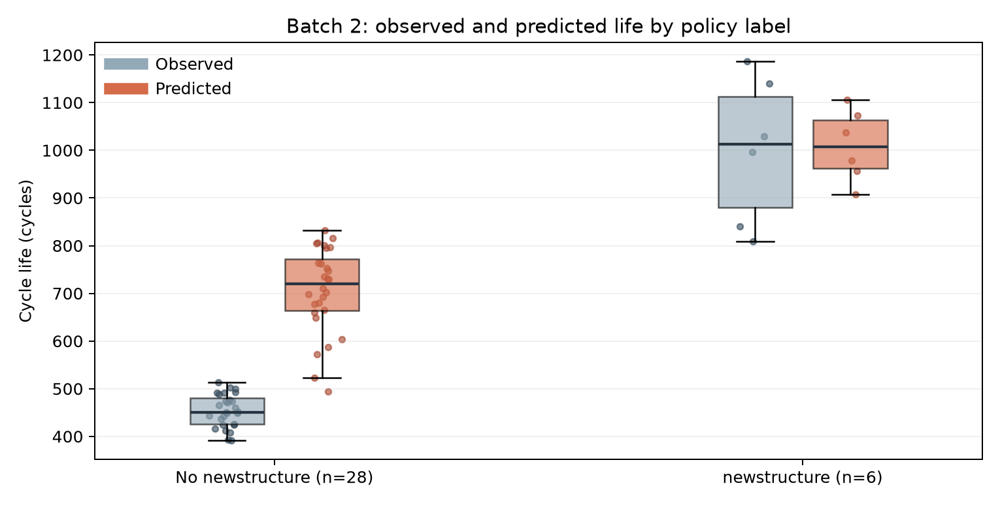

# DS, Mini Project : ESS 배터리 수명 예측 (DAY2)

**DS-MINI-Design · 울산 1반 · 박준형(U015) · 2026-10-01**

## 요약

- **예측 문제와 변수:** 셀의 초기 100사이클로 용량이 정격의 80%에 도달할 때까지의 총수명(`cycle_life`)을 예측했습니다. Day 1에서 고른 `log10 var(ΔQ(V))`, 초기 평균 방전 용량, 초기 평균 온도를 사용했습니다. 최종 모델은 Ridge 회귀(α=1)입니다.
- **평가 설계:** Batch 1의 46셀을 충전 정책별로 개발용 35셀과 별도 검증용 11셀로 나눴습니다. 개발용에서만 정책별 5분할 교차검증으로 후보를 비교했고, 모델을 정한 뒤 검증용과 Batch 2의 34셀을 평가했습니다. Batch 3의 40셀도 추가로 확인했습니다.
- **주요 성능:** MAPE는 Batch 1 개발용 CV **6.66%**, 별도 검증 **11.01%**, Batch 2 **48.67%**였습니다. 검증–CV 차이는 **+4.35%p**, Batch 2–검증 차이는 **+37.66%p**입니다. 원논문 참고값 9.1%와 Batch 2 결과의 차이는 **+39.57%p**이며, 데이터와 평가 조건이 달라 직접적인 재현 성패로 해석하지 않았습니다.
- **오차의 방향:** Batch 2는 실제 수명 중앙값이 469사이클인데 예측 중앙값은 741사이클이었습니다. 34셀 중 32셀을 길게 예측했고, 500사이클 미만 26셀의 평균 과대예측은 249사이클입니다. Batch 3 MAPE는 16.67%였지만 1,000사이클 초과 19셀을 평균 351사이클 짧게 예측했습니다.
- **제 판단:** 초기 `ΔQ(V)` 변화는 수명과 관련된 신호지만, Batch 1에서 배운 사이클 수의 기준을 다른 배치에 그대로 옮기기는 어려웠습니다. 이번 결과는 모델을 더 복잡하게 만들기 전에 배치별 수명 분포, 측정 조건, 표본 구성을 먼저 확인해야 한다는 근거가 됐습니다.
- **추가 검증과 개선:** 20개 후보를 같은 Batch 1 개발용 CV로 비교했습니다. 로그 타깃 Ridge의 CV가 5.84~6.19%로 낮았지만 Batch 2 오차는 줄지 않았습니다. 이후 Batch 2의 일부 레이블을 사용하는 별도 보정 실험에서, 정책이 겹치지 않은 평가 셀의 평균 MAPE가 무보정 48.79%에서 중앙 비율 보정 15.72%로 낮아졌습니다. 이 수치는 새로운 데이터 조건의 사후 실험 결과입니다.

## 목차

- 예측 문제와 평가 설계
  - 목표와 입력 변수 · 데이터 분할과 정보 누수 방지
- 후보 모델 비교와 선정
  - 개발용 교차검증 · Ridge를 유지한 이유
- 성능 평가
  - MAPE와 Gap · 사이클 단위 오차
- 오차 분석
  - 배치별 변수와 수명 이동 · Batch 2의 단수명 셀 · Batch 3의 장수명 셀
- 추가 모델 비교와 검증
  - 20개 후보의 동일 조건 비교 · 모델별 장단점
- Batch 2 보정 실험
  - 일부 수명 레이블을 활용한 보정 · 반복 검증 결과
- ESS 도메인 해석
  - 운영에서 쓸 수 있는 판단 · 실 배포에 필요한 데이터
- 제 생각과 시사점
  - 중요한 변수에 대한 판단 · 점수와 검증 범위 · ESS 운영에서의 오차 · 다음 배치의 검증 순서
- 참고 자료

## 예측 문제와 평가 설계

### 목표와 입력 변수

예측 대상은 `cycle_life`의 사이클 수입니다. Day 1에서 초기 방전 용량 자체보다 10사이클과 100사이클의 전압별 방전 용량 차이인 `ΔQ(V)`가 수명과 더 뚜렷하게 연결됐습니다. 그래서 `log10 var(ΔQ(V))`를 중심 변수로 유지했습니다. 여기에 초기 평균 방전 용량 `QD`와 초기 평균 온도 `Tavg`를 더했습니다. 온도는 단독 상관이 강하지 않았지만, 셀마다 다른 열 조건을 함께 보려는 보조 변수입니다. 세 변수는 모두 초기 100사이클 안에서 계산했습니다.

### 데이터 분할과 정보 누수 방지

수명이 확인된 Batch 1 46셀 중 **35셀을 개발용**, **11셀을 별도 검증용**으로 고정했습니다. 셀 단위로 나누되 같은 충전 정책의 셀이 두 집단에 섞이지 않도록 정책을 그룹으로 묶었습니다. 개발용의 5분할 CV에서도 정책 그룹을 유지했습니다. 결측 대체와 표준화는 매 학습 부분에서만 맞췄습니다. 수명값과 100사이클 이후에 계산한 knee 시점은 입력하지 않았습니다.

Batch 2의 수명 확인 34셀은 모델과 설정을 정한 뒤 평가했습니다. Batch 3의 40셀은 추가 평가입니다. 두 배치는 Day 1 EDA에서 분포를 이미 살펴봤으므로 완전히 처음 보는 외부 데이터라고 부르지는 않겠습니다. 다만 **두 배치의 점수로 변수나 모델을 다시 선택하지 않았습니다.** Batch 2의 예측에는 Batch 1 전체 46셀로 다시 학습한 모델을 사용했습니다. 따라서 별도 검증과 Batch 2의 차이에는 배치 이동뿐 아니라 학습 셀 수의 차이도 포함됩니다.

## 후보 모델 비교와 선정

### 개발용 교차검증

| 모델 | 입력 변수 | Batch 1 개발용 CV MAPE |
|---|---|---:|
| 중앙값 예측 | 없음 | 19.63% |
| Ridge, α=1 | `ΔQ(V)` 로그 분산·평균 QD·평균 Tavg | **6.66%** |
| Ridge, α=0.1 | 같은 세 변수 | 6.71% |
| Ridge, α=10 | 같은 세 변수 | 8.24% |
| Ridge, 정책 강도 추가 | 핵심 세 변수·SOC 가중 C-rate | 6.34% |
| Elastic Net, α=0.01 | 핵심 세 변수 | 6.71% |
| Elastic Net, α=0.1 | 핵심 세 변수 | 6.65% |
| 깊이 2 결정트리 | 핵심 세 변수 | 11.53% |

위 수치는 개발용 35셀에서 정책별 5분할 CV의 **폴드별 MAPE 평균**입니다. 이 CV로 후보를 골랐으므로 6.66%를 독립적인 최종 성능으로 보지 않았습니다. Day 1의 Batch 1 전체 46셀 CV 8.18%와도 분할이 달라 점수가 내려갔다고 해서 모델이 개선됐다고 해석하지 않았습니다. 중앙값 기준선보다 모든 핵심 변수 모델의 오차가 낮았고, 작은 트리는 이 표본에서 Ridge보다 오차가 컸습니다.

### Ridge를 유지한 이유

정책 강도를 추가한 Ridge가 내부 CV에서 6.34%로 가장 낮았습니다. 그러나 세 변수 Ridge와의 차이는 **0.32%p**입니다. Day 1에서 Batch 1의 정책 강도와 `ΔQ(V)` 로그 분산이 강하게 겹쳤고, Batch 2·3에서는 정책 강도와 수명의 관계가 약했습니다. 이 차이만으로 정책 변수를 확정하기 어렵다고 판단했습니다. 같은 세 변수의 Elastic Net과 Ridge 차이도 0.01%p에 불과합니다. 그래서 별도 검증 결과를 보기 전에 **세 변수 Ridge(α=1)**를 고정했습니다. 이 모델은 여러 모델의 예측을 결합하는 앙상블이 아니라, 하나의 정규화 선형 회귀입니다.

## 성능 평가

### MAPE와 Gap

| 구분 | MAPE (%) | 비고 |
|---|---:|---|
| Train (Batch 1 CV) | **6.66** | 개발용 35셀, 정책별 5분할 평균 |
| Valid (Batch 1 Hold-out) | **11.01** | 정책이 겹치지 않는 11셀 |
| Test (Batch 2) | **48.67** | Batch 1 전체로 재학습한 뒤 34셀 평가 |
| Gap (Train-Valid) | **+4.35%p** | Valid − Train, 검증 오차 증가 |
| Gap (Valid-Test) | **+37.66%p** | Batch 2 − Valid, 배치 이동 시 오차 증가 |
| Gap (Target-Test) | **+39.57%p** | Batch 2 − 원논문 참고값 9.1% |
| Test (Batch 3) | **16.67** | 추가 평가 40셀 |
| Gap (Batch2-Batch3) | **-32.00%p** | Batch 3 − Batch 2, Batch 3의 오차가 더 낮음 |
| Gap (Target-Test, Batch 3) | **+7.57%p** | Batch 3 − 원논문 참고값 9.1% |

Gap은 **뒤에 평가한 구간의 MAPE에서 앞 구간의 MAPE를 뺀 값**으로 정의했습니다. 따라서 `Gap (Batch2-Batch3)`의 음수는 Batch 3의 오차가 더 낮다는 뜻입니다. Batch 1의 별도 검증에서도 CV보다 오차가 4.35%p 높았고, Batch 2에서는 차이가 훨씬 커졌습니다. 이것만으로 학습 데이터에 대한 과적합 정도와 배치 차이의 영향을 정확히 나눌 수는 없습니다. 원논문의 9.1%도 셀 제외와 데이터 구성, 검증 절차가 현재 분석과 같지 않아 목표 대비 차이를 보여 주는 참고값으로만 두었습니다.

### 사이클 단위 오차

| 평가 구간 | MAE | RMSE |
|---|---:|---:|
| Batch 1 별도 검증 | 105사이클 | 130사이클 |
| Batch 2 | 237사이클 | 251사이클 |
| Batch 3 | 203사이클 | 303사이클 |

MAPE는 실제 수명 대비 몇 퍼센트를 틀렸는지 보여 주지만, 제가 실제로 얼마나 많은 사이클을 잘못 예측했는지도 중요하다고 생각했습니다. Batch 2의 MAE 237사이클은 이 배치의 실제 수명 중앙값 469사이클과 비교해도 큽니다. 평균적인 교체 시점을 잡는 데 그대로 쓰기 어려운 수준입니다.

## 오차 분석

### 배치별 변수와 수명 이동

제가 가장 중요한 입력으로 고른 `ΔQ(V)` 로그 분산의 중앙값은 Batch 1 **-3.85**, Batch 2 **-3.48**, Batch 3 **-4.15**입니다. 값이 큰 Batch 2에서 실제 수명 중앙값도 **859→469사이클**로 짧아졌고, 값이 작은 Batch 3에서는 **965사이클**로 길어졌습니다. 변수와 수명 변화의 **방향은 제 예상과 맞았습니다.** 그러나 Batch 2의 수명 감소 폭은 Batch 1에서 배운 회귀식이 예측한 폭보다 컸습니다. 이 그래프를 보고 `ΔQ(V)`를 빼기보다, 배치가 달라질 때 같은 신호가 몇 사이클을 뜻하는지 따로 확인해야겠다고 판단했습니다.

### Batch 2의 단수명 셀

Batch 1에서 학습한 셀의 최단 수명은 **534사이클**인데 Batch 2에는 500사이클 미만이 **26/34셀**입니다. Batch 2의 실제 수명 중앙값은 **469사이클**, 예측 중앙값은 **741사이클**이었습니다. 34셀 중 32셀을 길게 예측했고, 500사이클 미만 그룹은 평균 **249사이클** 과대예측했습니다. `batch2_029`는 452사이클을 832사이클로, `batch2_006`은 393사이클을 731사이클로 예측했습니다.

| Batch 2 정책 기록 | 셀 수 | 실제 수명 중앙값 | MAPE | 평균 예측 편향 |
|---|---:|---:|---:|---:|
| `newstructure` 표시 없음 | 28 | 451사이클 | 55.5% | +252사이클 |
| `newstructure` 표시 있음 | 6 | 1,013사이클 | 16.8% | +10사이클 |

큰 오차가 표시 없는 28셀에 집중됐습니다. 이 데이터에서 Batch 1과 Batch 2의 수명 분포가 비슷하다는 가정은 맞지 않았습니다. 다만 `newstructure`라는 기록의 정확한 실험 의미를 확인하지 못했으므로, 표시 자체가 수명을 늘렸다고 해석하지 않았습니다. Batch 1에는 같은 표시가 없어 Day 2의 Batch 1 전용 학습만으로 효과를 추정할 수도 없습니다.

이 차이를 보고 Batch 2 전체 평균 오차만으로 모델을 진단하면 중요한 집단 차이를 놓친다고 생각했습니다. 표시 없는 셀 28개의 실제 수명 중앙값은 451사이클인데, 모델은 이 집단을 전반적으로 길게 예측했습니다. 표시 있는 6셀은 표본이 작고 다른 실험 조건도 함께 달랐을 수 있습니다. 다음 데이터에서는 이 기록의 정의와 측정 시점을 먼저 확인한 뒤, **예측 시점에 알 수 있는 조건인지**를 판단해야 변수 후보로 삼을 수 있습니다.

저는 Day 1에서 `ΔQ(V)` 로그 분산과 수명의 관계가 세 배치에서 같은 방향이라는 점을 중요하게 봤습니다. 그 판단은 수명의 상대적 순서를 구분하는 데 도움이 될 수 있지만, **Batch 1에서 배운 절대 사이클 수까지 그대로 맞춘다는 뜻은 아니었습니다.** Batch 2에서도 예측값과 실제값의 Pearson 상관은 약 0.79였지만 수명 수준을 전반적으로 높게 잡았습니다. 상관과 예측 오차를 함께 봐야 한다는 점을 여기서 확인했습니다.

Batch 2의 `ΔQ(V)` 로그 분산 중앙값은 **-3.48**로 Batch 1의 **-3.85**보다 높았습니다. 모델도 이 신호를 받아 Batch 2의 예측 수명 중앙값을 Batch 1의 실제 수명 중앙값 859사이클보다 낮은 741사이클로 잡았습니다. 하지만 실제 중앙값은 469사이클이었습니다. 변화 방향을 반영한 것과 변화 폭을 충분히 맞춘 것은 다른 문제였습니다. Batch 1 전체로 학습한 모델에서 표준화된 변수의 계수 크기도 `ΔQ(V)` 로그 분산이 약 **-157사이클**, 평균 QD가 **+40사이클**, 평균 Tavg가 **-7사이클**로, 선택한 핵심 변수의 영향이 가장 컸습니다. 이는 모델의 수치적 가중치이며 열화의 인과 효과를 뜻하지 않습니다.

### Batch 3의 장수명 셀

Batch 3의 전체 MAPE는 **16.67%**로 Batch 2보다 낮았습니다. 그러나 실제 1,000사이클 초과 19셀은 평균 **351사이클** 짧게 예측했습니다. 가장 큰 오차는 `batch3_038`로, 실제 **1,935사이클**을 **946사이클**로 예측했습니다. Batch 1의 최대 수명은 1,227사이클이지만 Batch 3에는 1,935사이클 셀까지 있습니다. 수명 상단을 길게 예측하는 데 한계가 보입니다. Batch 3은 충전 커브의 시작 시점과 수명 분포가 달라 `ΔQ(V)` 값을 다른 배치와 단순히 같은 기준으로 해석하기도 어렵습니다. 원논문 공개 코드의 노이즈 채널 6셀은 제외했지만 남은 셀의 측정 조건까지 같다고 확인한 것은 아닙니다. 따라서 16.67% 하나로 Batch 3에서 일반화가 충분하다고 판단하지 않았습니다.

수명 구간별 **예측값 − 실제값**을 보면, Batch 2의 500사이클 미만에서는 **+249사이클**, Batch 3의 1,000사이클 초과에서는 **-351사이클**입니다. 양의 오차는 수명이 짧은 셀을 늦게 발견할 위험을, 음의 오차는 오래 쓰는 셀을 일찍 교체할 위험을 뜻합니다. 저는 전체 MAPE 하나보다 **어느 수명 구간에서 어느 방향으로 틀렸는지**가 ESS 운영 판단에 더 직접적인 정보라고 봅니다. 각 막대의 셀 수도 함께 표시해 소수 셀의 평균을 전체 배치의 성질로 일반화하지 않도록 했습니다.

## 추가 모델 비교와 검증

### 20개 후보의 동일 조건 비교

Batch 2에서 큰 오차를 본 뒤, 어떤 모델 가정이 문제인지 확인하려고 20개 설정을 더 넓게 비교했습니다. **Batch 1 개발용 35셀, 정책별 5분할, 같은 셀별 변수**를 유지했습니다. 선형·정규화 회귀, 이상치에 강한 회귀, 로그 타깃 회귀, 커널·이웃 모델, 단일 트리, 세 종류의 앙상블을 넣었습니다. 아래의 Batch 1 별도 검증과 Batch 2·3 값은 이미 이전 Ridge 결과를 확인한 뒤에 계산한 **사후 진단 수치**입니다. 새 독립 테스트 성능으로 부르지 않겠습니다.

| 후보 모델 | Batch 1 CV | 별도 검증 | Batch 2 | Batch 3 |
|---|---:|---:|---:|---:|
| 로그 Ridge + 정책 강도 | **5.84%** | 14.67% | 64.70% | 23.00% |
| 로그 Ridge, 핵심 세 변수 | 6.19% | 15.16% | 50.48% | 16.85% |
| Ridge + 정책 강도 | 6.34% | 10.58% | 66.25% | 22.89% |
| Elastic Net α=0.1 | 6.65% | 10.79% | 49.28% | 16.88% |
| 기존 Ridge α=1 | 6.66% | 11.01% | 48.67% | 16.67% |
| Elastic Net α=0.01 | 6.71% | 11.26% | 48.28% | 16.53% |
| Ridge α=0.1 | 6.71% | 11.28% | 48.22% | 16.50% |
| 선형회귀 | 6.72% | 11.31% | 48.16% | 16.48% |
| Ridge α=10 | 8.24% | 9.01% | 52.69% | 17.72% |
| Extra Trees | 8.51% | 8.09% | 37.72% | 13.58% |
| Random Forest + 정책 강도 | 8.94% | 6.36% | 43.54% | 17.02% |
| KNN, 이웃 3개 | 8.96% | 5.69% | 62.08% | 22.04% |
| RBF-SVR, C=1 | 9.26% | 8.89% | 59.54% | 19.12% |
| Gradient Boosting | 9.39% | 7.20% | 39.82% | 14.63% |
| Random Forest | 9.55% | 7.11% | 33.56% | 12.33% |
| KNN, 이웃 5개 | 9.60% | 8.34% | 57.73% | 18.43% |
| RBF-SVR, C=10 | 11.37% | 8.43% | 58.53% | 19.67% |
| 깊이 2 결정트리 | 11.53% | 8.62% | **29.40%** | 13.74% |
| Huber 회귀 | 16.49% | 12.90% | 66.44% | 19.08% |
| 중앙값 기준선 | 19.63% | 16.49% | 76.79% | 18.82% |

20개 설정의 Batch 1 CV 오차와 Batch 2 오차의 순위 상관은 **약 0.01**, Batch 3과는 **약 -0.07**입니다. 이 후보 집합에서는 내부 CV 순위가 다른 배치의 순위를 알려 주지 못했습니다. 후보들이 서로 비슷한 변형을 포함하므로 이 상관을 독립 표본에 대한 통계 검정으로 해석하지는 않았습니다. 제가 이 그림에서 확인한 것은 **Batch 1의 최저 점수만으로 새 배치의 최저 점수를 고를 근거가 없었다**는 점입니다.

### 모델별 장단점

개발용 CV만 보면 **로그 타깃 Ridge**가 가장 좋았습니다. 하지만 새 후보를 적용하니 핵심 세 변수 로그 Ridge의 Batch 2 MAPE는 **50.48%**, 정책 강도를 더한 모델은 **64.70%**였습니다. 짧은 수명 셀의 과대예측을 줄일 것이라는 제 가설은 이 데이터에서 성립하지 않았습니다. 특히 정책 강도는 Batch 1 CV를 낮추면서 Batch 2 오차를 키웠습니다. Day 1에 두 변수의 정보가 겹친다고 판단했던 이유를 더 분명히 확인했습니다.

Batch 2 수치만 보면 깊이 2 트리가 **29.40%**로 가장 낮고 Random Forest도 **33.56%**입니다. 그러나 두 모델의 Batch 1 CV는 각각 **11.53%·9.55%**로 기존 Ridge의 6.66%보다 높습니다. 단순 트리가 예측을 Batch 1의 수명 범위 안으로 제한한 것이 Batch 2의 짧은 수명에는 우연히 유리했을 수 있습니다. Batch 3에는 Batch 1의 최장 수명 1,227사이클을 크게 넘는 셀이 있으므로, 트리 점수만 보고 배치 전반의 해결책으로 선택하지 않았습니다. **Batch 2 점수로 새 모델을 확정하면 이미 본 평가 데이터를 모델 선택에 사용하는 셈**이기 때문입니다.

## Batch 2 보정 실험

### 일부 수명 레이블을 활용한 보정

모델을 바꾸는 것보다 **새 배치의 수명 기준을 알려 주는 정보**가 필요한지 확인했습니다. Batch 1 전체로 학습한 기존 세 변수 Ridge는 그대로 두고, Batch 2의 충전 정책 약 1/3에서 수명 레이블을 얻었다고 가정했습니다. 보정용과 평가용에 같은 정책이 들어가지 않도록 50번 나눴습니다. 보정용 셀은 중앙값 기준 **11개**, 평가용은 **23개**였습니다. 보정 방법은 기존 예측을 그대로 쓰기, 보정용의 중앙 잔차를 더하기, 보정용의 실제값/예측값 중앙 비율을 곱하기 세 가지입니다. 평가용의 실제 수명은 보정값 계산에 쓰지 않았습니다.

### 반복 검증 결과

| 방법 | 50회 평균 MAPE | MAPE 중앙값 | 50회 평균 MAE |
|---|---:|---:|---:|
| 무보정 | 48.79% | 48.92% | 237사이클 |
| 중앙 잔차 이동 | 17.37% | 16.15% | 105사이클 |
| 중앙 비율 보정 | **15.72%** | **14.43%** | 106사이클 |

중앙 비율 보정은 50번 모두 무보정보다 MAPE가 낮았습니다. 이 차이는 Batch 1 모델을 복잡하게 만들어서 얻은 성능이 아닙니다. **Batch 2에서 7~15개의 수명 레이블을 추가로 쓴 결과**입니다. 같은 셀이 여러 반복에 참여하므로 50회를 독립적인 테스트 50개로 해석할 수도 없습니다. 그리고 Batch 2 전체 레이블로 계산한 보정값을 Batch 3에 옮기면 MAPE가 기존 **16.67%에서 42.67%**로 악화됐습니다. 따라서 보정값은 Batch 2에 특화돼 있으며, 새로운 배치에서 다시 검증해야 합니다.

## ESS 도메인 해석

### 운영에서 쓸 수 있는 판단

초기 `ΔQ(V)` 분산은 같은 실험 조건의 셀들 가운데 열화가 빠를 가능성이 있는 셀을 **추가 관찰 대상으로 선별하는 신호**로 볼 수 있습니다. 그러나 Batch 2의 짧은 수명 셀을 평균 249사이클 길게 예측했습니다. 이 예측을 그대로 ESS 교체 일정에 반영하면, 실제 용량 저하보다 늦게 대응할 위험이 있습니다. 반대로 무조건 수명을 짧게 잡으면 아직 쓸 수 있는 셀을 일찍 교체하게 됩니다. 저는 현재 모델의 숫자 하나로 교체를 결정하기보다, 배치별 예측 편향과 오차 범위를 먼저 확인해야 한다고 판단했습니다.

### 실 배포에 필요한 데이터

이번 데이터는 단일 셀의 반복 충방전 실험입니다. 실제 ESS에서는 셀 여러 개의 편차, 팩의 온도 분포, 운전 중 충방전 깊이와 휴지 시간, BMS 측정 오차가 수명 판단에 함께 들어갑니다. 셀 수명 예측값을 팩의 SOH나 교체 시점으로 옮기려면 이런 운전 데이터를 모으고, 새 설치 배치에서 소수 셀의 실제 수명 레이블을 확보해 보정 절차를 검증해야 합니다. Batch 2에서 얻은 보정값을 Batch 3에 옮겼을 때 오차가 커진 결과는 **보정도 배치별 확인 없이 재사용할 수 없다는 근거**입니다.

## 제 생각과 시사점

### 중요한 변수에 대한 판단

Day 1에서는 세 배치에서 상관 방향이 유지된 `ΔQ(V)` 로그 분산을 가장 중요한 변수로 골랐습니다. 지금도 이 선택은 유지합니다. 초기 10사이클과 100사이클의 전압별 용량 차이는 셀이 일찍 보이는 변화를 담고 있고, 배치별 수명 중앙값의 방향도 이 변수와 맞았습니다. 반면 Batch 2의 실제 수명 469사이클을 741사이클로 예측한 결과는 **변수의 중요도와 절대 수명의 정확도가 별개**라는 점을 보여 줍니다. 저는 변수의 상관이 높으면 다른 배치에서도 회귀식이 통할 것이라고 기대했지만, 이번에는 그 기대가 지나쳤습니다.

그래서 `ΔQ(V)`를 없애거나, Batch 2에서 오차가 컸다는 이유만으로 새 변수를 무작정 늘리지는 않겠습니다. 먼저 같은 전압 구간과 충전 커브 시작점에서 값이 계산됐는지 확인하겠습니다. 초기 평균 `QD`는 셀의 시작 용량 차이를, `Tavg`는 열 조건을 보조적으로 담기 위해 남겼습니다. 이 변수들이 배치 이동을 해결했다고 말할 근거는 없습니다. 후속 분석에서는 세 변수의 배치별 분포와 측정 정의를 확인하고, 셀 수가 충분해지면 **배치 안에서의 관계와 배치 사이의 기준 이동**을 따로 평가하겠습니다.

### 점수와 검증 범위

Batch 1 개발용 CV 6.66%만 봤다면 모델을 잘 만들었다고 생각했을 것입니다. 그러나 정책을 분리한 검증에서는 11.01%, Batch 2에서는 48.67%였습니다. 저는 이번 프로젝트에서 가장 큰 교훈이 모델 종류보다 **어떤 집단으로 검증했는지**에 있다고 봅니다. 20개 후보 중 로그 Ridge는 내부 CV를 5.84%까지 낮췄지만 Batch 2는 64.70%였고, 깊이 2 트리는 Batch 2에서 29.40%였지만 내부 CV는 11.53%였습니다. 두 수치 중 편한 것만 골라 새 최적 모델이라고 부르면, 이미 확인한 배치에 맞춰 결론을 바꾸는 셈입니다.

최종 Ridge는 성능이 가장 높아서가 아니라, **Batch 1 개발 결과와 변수 해석을 바탕으로 평가 전에 고정한 기준 모델**이기 때문에 유지했습니다. 20개 설정의 내부 CV 순위와 Batch 2 오차 순위가 거의 무관했던 결과도 이 판단을 뒷받침합니다. 다만 정책별 hold-out이 11셀이라 점수의 변동 가능성이 있고, Batch 2·3의 분포를 Day 1에 이미 본 상태입니다. 앞으로 새 모델을 선택하려면 후보와 기준을 먼저 고정하고, 아직 보지 않은 실험 시기와 충전 정책의 셀로 다시 검증해야 합니다.

### ESS 운영에서의 오차

제가 ESS 운영 관점에서 가장 우려하는 것은 Batch 2의 **짧은 수명을 길게 예측한 오차**입니다. 실제 500사이클 미만 26셀을 평균 249사이클 길게 봤습니다. 교체나 정밀 점검 시점을 이 숫자에만 의존하면 열화가 먼저 진행된 셀에 늦게 대응할 수 있습니다. 반대로 Batch 3의 1,000사이클 초과 19셀은 평균 351사이클 짧게 예측했습니다. 이 방향의 오차는 아직 쓸 수 있는 셀을 일찍 제외할 수 있습니다. 전체 MAPE가 Batch 3에서 더 낮아도 장수명 구간의 편향을 따로 적은 이유입니다.

따라서 현재 모델을 의사결정에 쓴다면 수명 숫자 하나를 확정값으로 제시하기보다, **같은 측정 조건의 셀을 추가 관찰할 우선순위**로 제한하겠습니다. 실제 팩에는 셀 간 편차와 온도 불균형, 운전 중 충방전 깊이와 휴지 시간이 더해집니다. 이 실험의 셀별 오차만으로 팩 교체 임계값을 정할 수는 없습니다. 현장 데이터에서는 팩의 SOH와 실제 운전 이력을 같이 기록하고, 과대예측과 과소예측에 서로 다른 비용을 두어 평가해야 한다고 생각합니다.

### 다음 배치의 검증 순서

Batch 2에서 `newstructure` 표시가 없는 28셀과 있는 6셀은 수명과 오차가 크게 달랐습니다. 저는 이 차이가 새로운 단서라고 봤지만, 기록의 정확한 의미와 다른 실험 조건을 확인하지 못했습니다. 표시가 원인이라고 주장하거나, 예측 시점에 알 수 있는 변수라고 가정하지 않겠습니다. 먼저 데이터 사전과 측정 시점, 제외 셀의 이유를 확인하고, 충전 프로토콜별 표본 수를 정리해야 합니다. 특히 Batch 3의 충전 커브 시작점 차이가 `Qdlin` 기반 `ΔQ(V)`를 얼마나 흔드는지 같은 전압 구간으로 재계산해 보겠습니다.

그다음 새 배치에서 **어떤 정책의 셀을 몇 개 먼저 추적할지** 정하고, 확보한 수명 레이블만으로 보정값을 만들겠습니다. Batch 2의 정책 분리 반복 실험에서 중앙 비율 보정은 MAPE를 평균 48.79%에서 15.72%로 낮췄습니다. 이는 수명 레이블 7~15개를 추가로 사용한 사후 결과입니다. Batch 2의 보정값을 Batch 3에 그대로 적용하면 16.67%에서 42.67%로 악화됐으므로, 보정도 새 배치마다 다시 검증해야 합니다. 보정 절차와 평가 정책을 미리 고정한 뒤, **보정에 참여하지 않은 셀과 다음 실험 배치**에서 오차의 크기와 방향을 함께 보고 싶습니다.

## 참고 자료

- [Severson 외, *Data-driven prediction of battery cycle life before capacity degradation*](https://doi.org/10.1038/s41560-019-0356-8): 초기 사이클 기반 수명 예측과 9.1% 참고값.
- [MIT–Stanford 배터리 데이터셋](https://www.kaggle.com/datasets/itshpark/data-driven-prediction-of-battery-cycle): Batch 1·2·3 원자료.
- [미국 에너지부 ESS 연구·개발](https://www.energy.gov/oe/energy-storage-rdd), [NREL 저장 시스템 구성 자료](https://www.nrel.gov/docs/fy22osti/83586.pdf): ESS 구성과 운영 맥락 참고.
