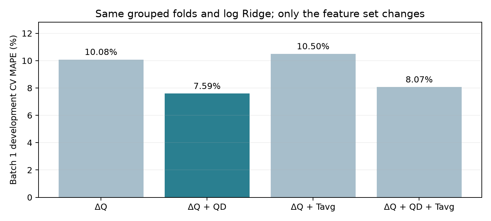
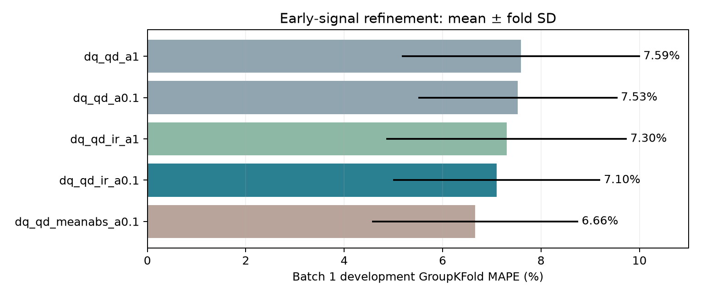
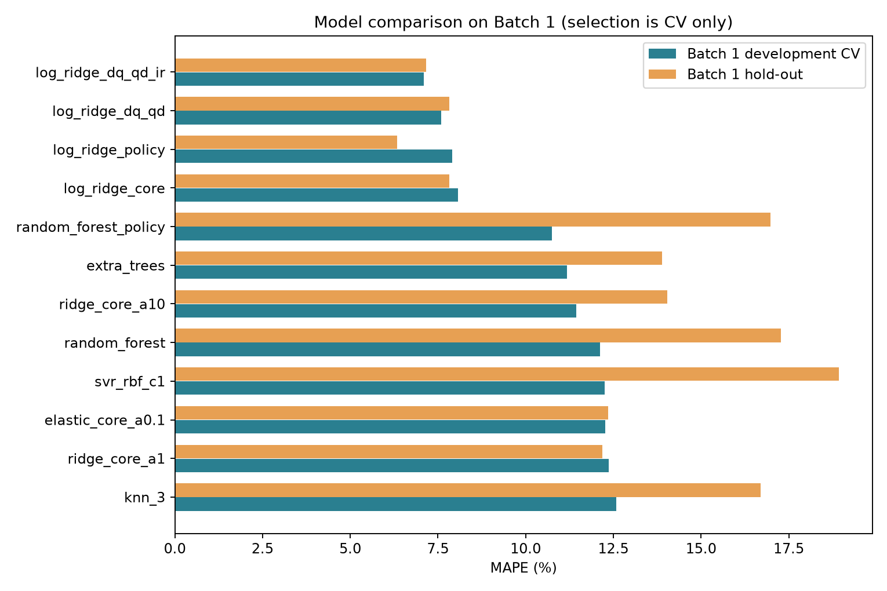
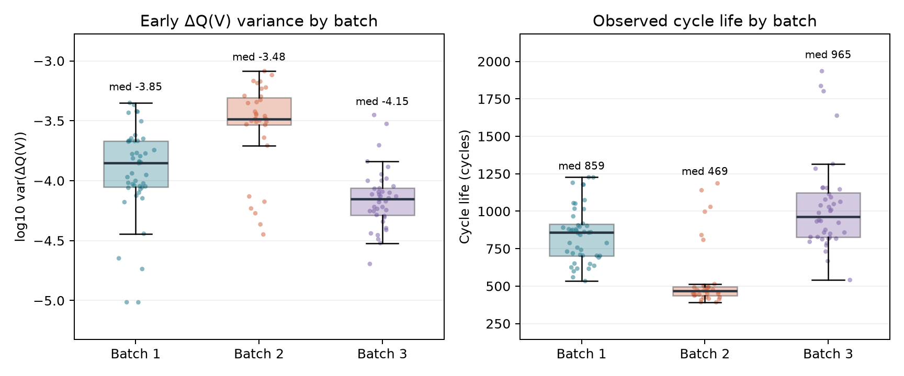
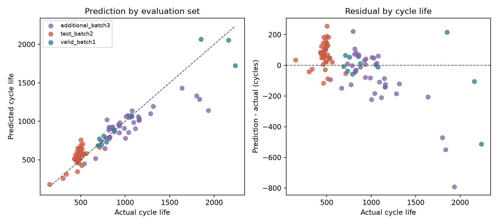
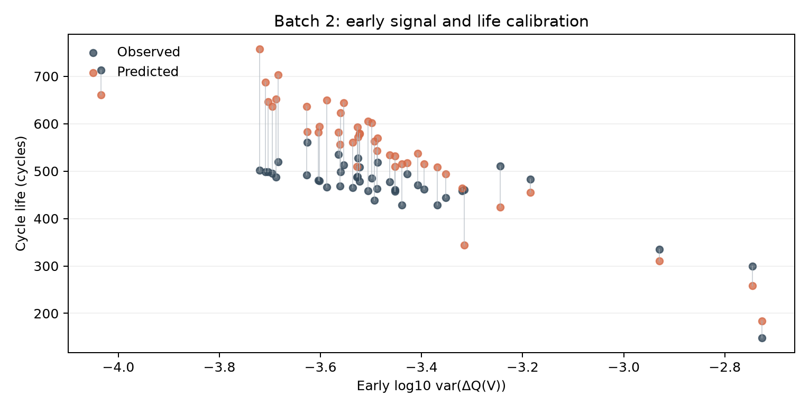
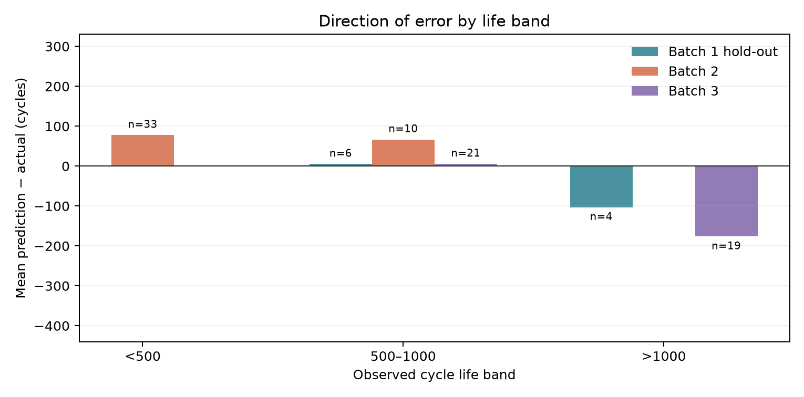
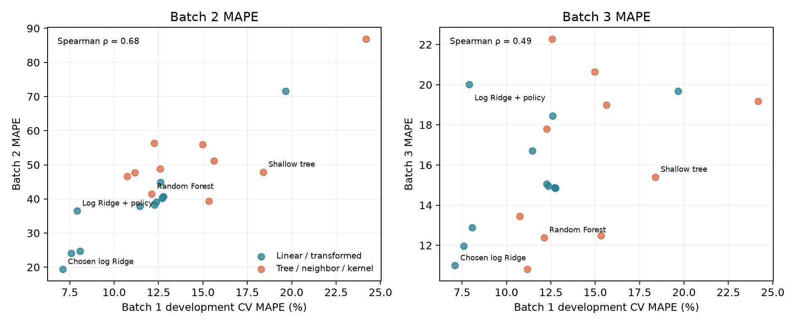
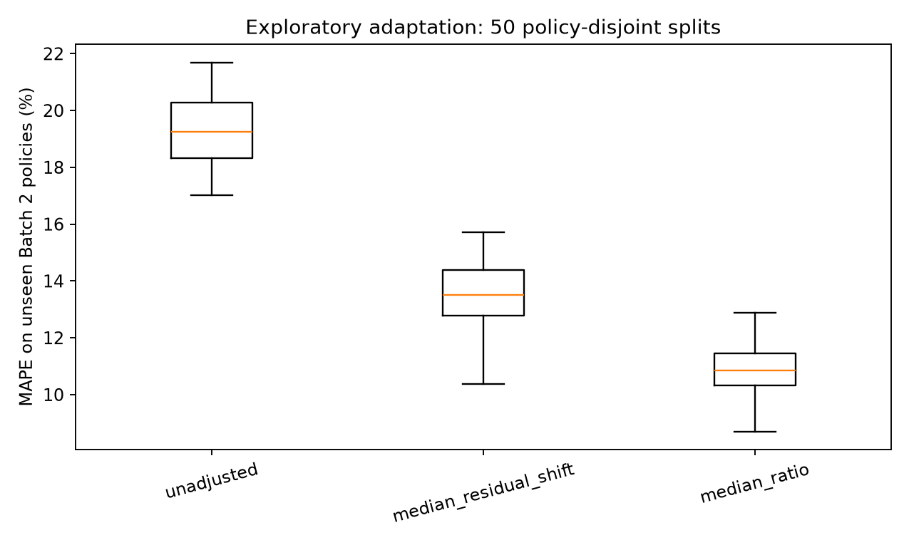

# DS, Mini Project : ESS 배터리 수명 예측 (DAY2)

**DS-MINI-Design · 울산 1반 · 박준형(U015) · 2026-10-02**

## 요약

- **검증 질문:** Day 1에서 고른 초기 `ΔQ(V)` 신호가 새로운 실험 배치에서도 수명을 예측하는지 확인했습니다. 정격 용량의 80%에 도달할 때까지의 사이클 수를 예측하는 회귀 문제로 두고, Batch 1 **41셀**을 학습에, Batch 2 **43셀**을 필수 테스트에, Batch 3 **40셀**을 추가 평가에 사용했습니다.
- **변수와 모델 결정:** 초기 `ΔQ(V)`의 로그 분산을 핵심으로 두고, 1~100사이클의 평균 방전 용량 `QD`와 내부저항 `IR`을 함께 사용했습니다. 기존 `ΔQ(V)+QD` 로그 Ridge의 개발용 CV는 **7.59% MAPE**, `IR`을 추가하고 Ridge 규제 강도를 0.1로 낮춘 모델은 **7.10%**였습니다. 초기 `IR`의 단순 상관은 약하지만 기존 두 변수와 겹치지 않는 정보가 있다고 판단했습니다. 선택 모델은 **단일 로그 타깃 Ridge**이며 앙상블은 아닙니다.
- **필수 성능:** Batch 1 개발용 정책별 CV **7.10%**, 정책이 겹치지 않는 hold-out **7.15%**, Batch 2 **19.39% MAPE**입니다. Gap은 Valid-Train **+0.06%p**, Batch 2-Valid **+12.24%p**, Batch 2-논문 참고값 9.1% **+10.29%p**입니다. Batch 3의 추가 평가 MAPE는 **10.99%**입니다. 이전 2변수 모델의 Batch 2 **24.11%**보다 낮지만 배치 이동 오차는 남았습니다.
- **오차의 방향:** Batch 2의 실제 수명 중앙값은 **481사이클**, 예측 중앙값은 **570사이클**입니다. **43셀 중 37셀**을 길게 봤고, 500사이클 미만 **33셀**에서는 평균 **78사이클 과대예측**했습니다. Batch 3의 1,000사이클 초과 **19셀**은 평균 **177사이클 과소예측**했습니다. 수치가 개선돼도 같은 방향의 편향이 남아 있습니다.
- **결론과 한계:** 초기 내부저항을 더하자 개발용 CV와 두 평가 배치의 오차가 줄었습니다. 다만 IR 후보는 이전 Batch 2 결과를 본 뒤 탐색했으며, Batch 1의 작은 표본에서 여러 조합을 비교했습니다. **19.39%를 독립적으로 검증된 일반화 성능으로 주장하지 않습니다.** 새 배치에서 측정 조건과 수명 기준을 맞춘 뒤 동일한 절차를 다시 시험해야 합니다.

## 목차

- 검증 질문과 데이터 분할
  - 초기 ΔQ(V) 신호의 배치 간 적용 가능성 · 분석 셀과 수명 목표값 · 정책별 분할과 검증 이력
- 초기 변수 비교와 모델 개선
  - QD·Tavg·IR을 비교한 이유 · 22개 후보의 Batch 1 비교 · 내부저항을 더한 모델을 선택한 근거
- 모델 성능과 논문 기준 비교
  - CV·hold-out·Batch 2 성능과 Gap · 사이클 단위 오차와 논문 비교 범위
- 배치별 예측 오차와 분포 이동
  - Batch 2의 짧은 수명 분포 · Batch 2의 단수명 과대예측 · Batch 3의 장수명 과소예측
- 사후 실험과 재검증 계획
  - 후보별 배치 이동 비교 · Batch 2 소수 레이블 보정 · 새 배치에서 다시 검증할 절차
- ESS 운영에서의 판단과 제 생각
  - 점검 우선순위에 쓸 수 있는 신호 · 변수를 바꾼 뒤 남은 결론 · 현장 적용 전 개선 순서
- 참고 자료

## 검증 질문과 데이터 분할

### 초기 ΔQ(V) 신호의 배치 간 적용 가능성

Day 1에서 가장 눈에 띈 것은 초기 방전 용량 곡선 변화였습니다. `ΔQ(V)` 로그 분산과 수명의 Spearman 상관은 Batch 1·2·3에서 **-0.88·-0.65·-0.76**이었습니다. 세 배치에서 방향이 같았기 때문에 이 신호를 모델의 중심에 놓았습니다. 그러나 Batch 1의 최단 수명은 **534사이클**이고 Batch 2에는 **500사이클 미만이 33/43셀**입니다. 따라서 Day 2의 질문은 “상관이 있는가”에서 끝나지 않습니다. **Batch 1에서 학습한 사이클 수를 Batch 2에도 맞힐 수 있는가**를 확인해야 합니다.

초기 온도와 충전 조건도 함께 검토했습니다. 온도 `Tavg`와 수명의 상관은 Batch 1에서 **-0.39**, Batch 2·3에서는 **+0.09·+0.02**였습니다. 충전 정책 강도는 Batch 1에서 `ΔQ(V)` 로그 분산과 Pearson 상관이 **0.96**이었습니다. 저는 두 변수가 도메인에서 의미 있다는 이유만으로 모두 넣지 않고, **추가했을 때 Batch 1의 정책 분리 검증에서 실제로 이득이 있는지** 먼저 보았습니다.

### 분석 셀과 수명 목표값

원논문의 원자료 파일 `2017-05-12`, `2017-06-30`, `2018-04-12`를 Batch 1·2·3으로 사용했습니다. 원본에는 각각 **46·48·46셀**이 있습니다. 공개 전처리 코드에 따라 Batch 1의 80% 종료점 미도달 **5셀**, Batch 2의 연속 측정 **5셀**, Batch 3의 노이즈 채널 **6셀**을 분석 집단에서 제외했습니다. Batch 1 첫 5셀의 수명 레이블에는 이어 측정한 길이 **662·981·1,060·208·482사이클**을 각각 더했습니다. 다만 방전 용량 곡선은 이어 붙이지 않았으므로 이 5셀의 knee는 Day 1 EDA에서 계산하지 않았습니다. 최종 대상은 **41·43·40셀**입니다.

목표값 `cycle_life`는 정격 용량의 80%에 도달할 때까지의 사이클 수입니다. 예측 입력은 100사이클까지 확보할 수 있는 값으로 제한했습니다. 후반 용량 곡선이나 knee는 수명 설명에 유용해도 모델에는 넣지 않았습니다. Batch 2의 연속 기록 5셀은 Batch 1의 레이블을 완성하는 데만 쓰고, Batch 2 테스트 집단에서는 제외했습니다. 같은 물리적 셀이 학습과 테스트에 중복되지 않도록 한 처리입니다.

### 정책별 분할과 검증 이력

Batch 1의 **41셀**을 충전 정책 단위로 개발용 **31셀**과 hold-out **10셀**로 나눴습니다. 개발용에서 정책별 5분할 `GroupKFold`를 수행했고, 한 정책의 셀이 학습·검증에 동시에 들어가지 않게 했습니다. 결측 대체와 표준화는 각 학습 폴드에서만 맞췄습니다. 후보를 고른 뒤 개발용으로 학습한 모델을 hold-out에 적용하고, Batch 1 전체로 다시 학습해 Batch 2를 테스트했습니다. Batch 3은 추가 평가입니다.

보고 표의 **Train (Batch 1 CV)**는 학습 데이터 자체의 오차가 아니라, 개발용 5개 검증 폴드의 MAPE 평균입니다. Hold-out은 같은 배치에서 충전 정책을 분리한 평가이며, Batch 2는 실험 배치를 바꾼 평가입니다. 두 결과의 차이에는 배치 이동뿐 아니라 학습 셀 수가 **31→41개**로 바뀐 영향도 포함됩니다. 정책을 분리해도 비슷한 정책끼리의 정보 공유까지 완전히 막을 수는 없습니다.

Day 1의 사전 모델 비교는 **Batch 1 전체 41셀**로 수행했습니다. 따라서 이번 hold-out 10셀도 이전 탐색 단계에서는 사용됐습니다. Day 2의 후보 비교와 변수 제거 실험에는 이 10셀을 넣지 않았지만, **7.15%를 처음부터 한 번도 보지 않은 셀의 검증 성능으로 해석하지는 않겠습니다.** 이후 실험에서는 첫 EDA·모델 비교 전에 hold-out을 고정해야 합니다.

Day 1에서 Batch 2·3의 분포를 보았고, 이전 2변수 모델의 Batch 2 결과 **24.11%**도 확인했습니다. 이번 `IR` 추가는 그다음에 진행한 **사후 탐색**입니다. 따라서 Batch 2에서 개선된 수치는 새로운 외부 시험 결과가 아닙니다. 다음에 얻을 새 배치로 같은 모델을 다시 확인해야 합니다.

## 초기 변수 비교와 모델 개선

### QD·Tavg·IR을 비교한 이유

Day 1의 일반 Ridge에서는 `ΔQ(V)` 단독 모델이 **12.97%**, `ΔQ(V)+QD+Tavg` 모델이 **13.27%**였습니다. 보조 변수를 넣을수록 좋아질 것이라는 기대와 달랐습니다. Day 2에는 목표값을 로그로 바꾼 같은 Ridge에서 변수 조합을 다시 비교했습니다. 수명은 양수이고 MAPE는 비율 오차를 보므로, 로그 타깃은 검토할 만한 변형이었습니다. 로그로 학습한 예측값은 지수변환해 사이클 수로 되돌렸습니다.

| 로그 Ridge 입력 | Batch 1 개발용 CV MAPE | 제 판단 |
|---|---:|---|
| `ΔQ(V)` 로그 분산 | 10.08% | 초기 곡선 하나만으로도 기준선보다 낫습니다. |
| `ΔQ(V)` 로그 분산 + 평균 `QD` | **7.59%** | 용량 수준 정보가 곡선 변화에 없는 부분을 보탰습니다. |
| `ΔQ(V)` 로그 분산 + 평균 `Tavg` | 10.50% | 온도만 추가해서는 오차가 줄지 않았습니다. |
| `ΔQ(V)` 로그 분산 + 평균 `QD` + 평균 `Tavg` | 8.07% | 온도를 다시 더하자 0.48%p 높아졌습니다. |

평균 `QD`는 1~100사이클의 방전 용량 수준이고 `ΔQ(V)`는 10→100사이클 곡선의 전압별 변화입니다. 둘은 같은 용량 기록에서 나오지만 요약하는 측면이 달라, 이 제거 실험에서는 함께 쓸 근거가 생겼습니다. 온도는 배터리 열화에 중요한 조건이더라도 이번 배치의 예측 변수로는 이득을 확인하지 못했습니다. 이 단계에서 `ΔQ(V)+QD`를 기본 모델로 남겼습니다.

초기 내부저항 `IR`은 전류가 흐를 때 전압 손실과 관련된 값이므로, 충전 정책표보다 셀의 실제 상태에 가까운 입력이라고 생각했습니다. 그렇다고 `IR` 하나만으로 수명을 설명할 수 있다는 뜻은 아닙니다. 수명과의 Spearman 상관은 Batch 1·2·3에서 **+0.21·+0.10·+0.21**로 약했습니다. 저는 기존 두 변수를 알고도 `IR`이 오차를 줄이는지 확인했습니다. Batch 1 개발용에서 `IR`과 `ΔQ(V)` 로그 분산의 Pearson 상관은 **-0.32**, 평균 `QD`와는 **+0.19**였습니다. 완전히 독립적인 값은 아니지만 같은 숫자를 반복한 수준도 아닙니다.

| 추가 비교 | Batch 1 개발용 CV MAPE | 판단 |
|---|---:|---|
| `ΔQ(V)+QD`, α=1.0 | 7.59% | 기존 2변수 기준입니다. |
| `ΔQ(V)+QD`, α=0.1 | 7.53% | 규제 강도만 바꾼 효과는 0.06%p였습니다. |
| `ΔQ(V)+QD+IR`, α=1.0 | 7.30% | 같은 규제 강도에서 `IR`을 더한 효과가 보였습니다. |
| **`ΔQ(V)+QD+IR`, α=0.1** | **7.10%** | `IR`과 규제 강도를 함께 반영한 현재 모델입니다. |
| `ΔQ(V)+QD+ΔQ 평균절댓값`, α=0.1 | 6.66% | CV는 가장 낮았지만 두 ΔQ 요약값의 상관이 0.95로 높습니다. |

`IR` 모델의 5개 폴드 중 **3개**에서 기존 모델보다 MAPE가 낮았습니다. 4·5·6분할로 바꾸어도 평균 오차가 기존 모델보다 낮았지만, 이 작은 차이를 강한 우위로 보기는 어렵습니다. `ΔQ` 평균절댓값 후보는 CV가 더 낮았습니다. 그러나 Batch 1 개발용에서 로그 분산과 평균절댓값의 Pearson 상관이 **0.95**라 같은 곡선의 정보를 중복할 가능성이 큽니다. 따라서 **CV 최솟값 하나만을 선택 기준으로 삼지 않았습니다.** 물리적으로 다른 초기 측정값을 보탠다는 점과 분할별 변동을 함께 고려해 `IR` 후보를 남겼습니다. 여러 조합을 탐색한 결과이므로 CV 자체도 낙관적일 수 있습니다.

### 22개 후보의 Batch 1 비교

셀 수가 적고 초기 변수끼리 겹쳐서, 먼저 중앙값 기준선과 규제된 선형 모델을 비교했습니다. 이어 비선형성을 확인하기 위해 작은 트리·Random Forest·Extra Trees·Gradient Boosting·SVR·KNN 등을 같은 개발용 정책 분할에 넣었습니다. `IR` 모델을 추가해 총 **22개 설정**을 같은 분할에서 비교했습니다. 아래 표는 의사결정에 영향을 준 대표 후보입니다.

| 후보 | Batch 1 개발용 CV MAPE | EDA와 연결한 해석 |
|---|---:|---|
| 중앙값 기준선 | 24.18% | 입력 변수의 효과를 확인할 기준입니다. |
| 일반 Ridge, 3변수(α=1) | 12.36% | 단순한 절대 수명 회귀의 비교점입니다. |
| Elastic Net, 3변수(α=0.1) | 12.27% | 중복 변수 처리만으로 로그 변환의 이득을 대신하지 못했습니다. |
| 깊이 2 결정트리, 3변수 | 18.39% | 작은 표본에서는 단순 비선형 규칙도 불안정했습니다. |
| Random Forest, 3변수 | 12.11% | 앙상블의 내부 점수 이득이 확인되지 않았습니다. |
| 로그 Ridge, 3변수 | 8.07% | 로그 타깃은 분명히 개선됐지만 온도는 남은 의문입니다. |
| 로그 Ridge, 3변수+정책 강도 | 7.90% | 정책 변수가 `ΔQ(V)`와 겹칩니다. |
| 로그 Ridge, `ΔQ(V)+QD` | 7.59% | 기존 기준 모델입니다. |
| **로그 Ridge, `ΔQ(V)+QD+IR`** | **7.10%** | 다른 초기 측정값을 더해 오차를 줄인 후보입니다. |

### 내부저항을 더한 모델을 선택한 근거

기존 2변수 모델은 개발용 CV **7.59%**였고, `IR`을 더한 모델은 **7.10%**였습니다. 규제 강도만 1.0에서 0.1로 낮추면 **7.53%**여서 개선 전부가 α 조정 때문은 아닙니다. `Tavg`는 배치별 수명 상관이 흔들렸고 정책 강도는 `ΔQ(V)`와 많이 겹쳤습니다. 반면 `IR`은 도메인상 셀 상태를 나타내며 기존 두 입력과 완전히 겹치지 않았습니다. 그래서 **`ΔQ(V)` 로그 분산, 초기 평균 `QD`, 초기 평균 `IR`을 쓰는 로그 Ridge(α=0.1)**를 현재 제출 모델로 정했습니다. 단일 회귀이며 여러 모델의 예측을 합치지 않습니다.

이 선택은 이전 모델의 Batch 2 성능을 확인한 후에 이뤄졌습니다. Batch 1 개발용 CV의 **0.49%p** 개선도 표본 31셀과 여러 후보 탐색을 고려하면 확정적인 차이가 아닙니다. Hold-out과 Batch 2·3 점수는 다음 절에서 **사후 확인 결과**로 적겠습니다. 외부 배치에서 다시 검증될 때까지 보편적인 최적 모델이라고 부르지 않겠습니다.

## 모델 성능과 논문 기준 비교

### CV·hold-out·Batch 2 성능과 Gap

| 구분 | MAPE (%) | 비고 |
|---|---:|---|
| Train (Batch 1 CV) | **7.10** | 개발용 31셀, 정책별 5분할 평균 |
| Valid (Batch 1 Hold-out) | **7.15** | 정책이 겹치지 않는 10셀 |
| Test (Batch 2) | **19.39** | Batch 1 전체로 재학습 후 43셀 평가 |
| Gap (Train-Valid) | **+0.06%p** | Valid-Train |
| Gap (Valid-Test) | **+12.24%p** | Batch 2-Valid |
| Gap (Target-Test) | **+10.29%p** | Batch 2-원논문 참고값 9.1% |
| Test (Batch 3) | **10.99** | 추가 평가 40셀 |
| Gap (Batch2-Batch3) | **-8.40%p** | Batch 3-Batch 2 |
| Gap (Target-Test, Batch 3) | **+1.89%p** | Batch 3-참고값 9.1% |

Gap은 뒤 구간의 MAPE에서 앞 구간의 MAPE를 뺀 **퍼센트포인트**입니다. Train과 Valid의 차이는 **0.06%p**로 작지만, Batch 2에서는 Valid보다 **12.24%p** 높았습니다. 이전 모델의 Batch 2 MAPE **24.11%**와 비교하면 **4.72%p** 줄었습니다. 그러나 이를 ‘과적합이 없어졌다’는 뜻으로 읽지 않습니다. Hold-out은 10셀이고 Day 1 탐색에 노출됐으며, Batch 2도 이전 결과를 본 뒤 다시 평가했습니다. 새 배치에서 절대 수명 수준이 맞는지 여전히 확인해야 합니다.

### 사이클 단위 오차와 논문 비교 범위

| 평가 구간 | MAE | RMSE |
|---|---:|---:|
| Batch 1 hold-out | 108사이클 | 182사이클 |
| Batch 2 | 91사이클 | 106사이클 |
| Batch 3 | 128사이클 | 200사이클 |

MAPE만 보면 Batch 3이 Batch 2보다 훨씬 낫지만, Batch 3의 MAE는 오히려 **128사이클**로 더 큽니다. 실제 수명이 길면 같은 절대 오차가 더 작은 비율이 되기 때문입니다. 운영에서 점검 시기를 생각하려면 비율과 사이클 수를 함께 봐야 합니다. [원논문](https://web.mit.edu/braatzgroup/Severson_NatureEnergy_2019.pdf)의 **9.1%**는 논문이 제시한 회귀 테스트 참고값입니다. 모델·분할·셀 처리 조건이 이 분석과 같지 않으므로, **+10.29%p**는 과제 기준 대비 차이이지 동일 실험 재현 성적표가 아닙니다.

## 배치별 예측 오차와 분포 이동

### Batch 2의 짧은 수명 분포

`ΔQ(V)` 로그 분산 중앙값은 Batch 1 **-3.84**, Batch 2 **-3.52**, Batch 3 **-4.15**입니다. Batch 2에서는 곡선 변화가 상대적으로 크고 실제 수명 중앙값은 **481사이클**로 짧습니다. Batch 3은 곡선 변화가 상대적으로 작고 수명 중앙값은 **965사이클**입니다. EDA의 방향은 여전히 의미가 있습니다. 하지만 이 방향이 맞는다는 사실만으로 **Batch 2의 절대 수명값을 맞혔다고 할 수는 없습니다.**

Batch 1에는 534사이클보다 짧은 학습 셀이 없습니다. Batch 2의 43셀 중 33셀은 500사이클 미만입니다. 이는 단순히 이상치 몇 개의 문제가 아니라 평가 집단 대부분이 학습 범위 아래에 있는 상황입니다. 저는 Batch 2 성능 저하의 가장 먼저 확인할 설명을 이 **수명 분포의 차이와 예측 수준의 이동**으로 잡았습니다. 실험 시기, 정책 구성, 측정 시작 조건이 각각 얼마나 기여했는지는 이 분석만으로 분리할 수 없습니다.

<!-- PAGE BREAK -->

### Batch 2의 단수명 과대예측

Batch 2의 실제 수명 중앙값은 **481사이클**, 예측 중앙값은 **570사이클**입니다. **43셀 중 37셀**을 길게 예측했습니다. 500사이클 미만인 **33셀의 평균 편향은 +78사이클**입니다. 기존 모델의 +103사이클보다 줄었지만 방향은 같습니다. 실제 수명과 예측 수명의 Pearson 상관은 **0.74**여서 셀 사이 상대 순서는 일부 따라가지만, 전반적인 예측 수준이 높습니다. 운영에 연결한다면 빨리 열화되는 셀의 점검을 늦추는 방향입니다.

기존 2변수 모델과 셀별 절대비율오차를 맞대어 보니 Batch 2 **43셀 중 37셀**에서 `IR` 모델의 오차가 줄었습니다. 한 셀의 우연한 개선으로 평균만 낮아진 결과는 아닙니다. 그러나 같은 37셀을 여전히 길게 예측했다는 점은 **오차 크기는 줄었지만 배치 기준의 이동은 해결하지 못했다**는 뜻입니다.

가장 크게 틀린 `batch2_020`은 실제 **502사이클**을 **758사이클**로 예측했습니다. 오차는 **+256사이클**입니다. 한편 최단 수명 **148사이클** 셀은 **184사이클**로 예측됐습니다. 이 셀의 `ΔQ(V)` 로그 분산은 **-2.73**으로 배치 중앙값 **-3.52**보다 높아 초기 변화가 두드러집니다. 그러나 극단적으로 짧은 수명의 원인을 이 값이나 충전 정책 하나로 확정할 수 없습니다. 종료 기록과 측정 품질을 따로 확인할 필요가 있습니다.

### Batch 3의 장수명 과소예측

Batch 3 MAPE는 **10.99%**로 Batch 2보다 낮습니다. 그러나 실제 수명이 1,000사이클을 넘는 **19셀**은 평균 **177사이클 짧게** 예측했습니다. `batch3_038`은 실제 **1,935사이클**을 **1,143사이클**로 예측해 오차가 **-792사이클**입니다. Batch 3의 충전 커브 시작 시점은 다른 배치와 다르므로 `Qdlin` 기반 피처의 측정 정렬도 다시 확인해야 합니다. 이 차이가 오차의 원인이라고 단정하지는 않았습니다.

짧은 수명을 길게 보는 Batch 2와 긴 수명을 짧게 보는 Batch 3은 운영상 반대 방향의 위험입니다. 전자는 필요한 점검을 늦출 수 있고, 후자는 사용 가능한 셀을 너무 일찍 제외할 수 있습니다. 그래서 저는 전체 MAPE 하나보다 **수명 구간별 과대·과소예측과 표본 수**를 성능 해석에 같이 적었습니다.

## 사후 실험과 재검증 계획

### 후보별 배치 이동 비교

22개 설정을 Batch 1 개발용 CV에서 비교한 뒤, 같은 후보들의 hold-out·Batch 2·3 점수도 **원인 진단용**으로 계산했습니다. 아래 점수는 새 배치의 독립 성능 순위표가 아닙니다. 특히 `IR` 후보 자체가 이전 Batch 2 결과를 본 뒤 추가됐으므로 현재 개선 폭은 회고적입니다.

| 후보 | Batch 1 CV | Hold-out | Batch 2 | Batch 3 |
|---|---:|---:|---:|---:|
| **로그 Ridge, `ΔQ(V)+QD+IR`** | **7.10%** | **7.15%** | **19.39%** | **10.99%** |
| 로그 Ridge, `ΔQ(V)+QD` | 7.59% | 7.82% | 24.11% | 11.96% |
| 로그 Ridge, 3변수+정책 | 7.90% | 6.34% | 36.50% | 20.01% |
| 로그 Ridge, 3변수 | 8.07% | 7.82% | 24.67% | 12.88% |
| Random Forest, 3변수 | 12.11% | 17.28% | 41.42% | 12.38% |
| Extra Trees, 3변수 | 11.17% | 13.89% | 47.69% | 10.81% |
| Elastic Net, 3변수 | 12.27% | 12.35% | 38.31% | 15.06% |
| 깊이 2 결정트리 | 18.39% | 32.04% | 47.91% | 15.40% |
| 중앙값 기준선 | 24.18% | 27.73% | 86.87% | 19.17% |

정책 강도를 더한 로그 Ridge는 Batch 1 CV가 **7.90%**로 나쁘지 않았지만 Batch 2는 **36.50%**였습니다. `ΔQ(V)`와 정책 강도의 중복을 걱정한 이유가 실제 새 배치 오차와도 연결됩니다. Extra Trees의 Batch 3 점수는 **10.81%**로 현재 모델보다 약간 낮지만 Batch 2는 **47.69%**입니다. 한 배치에서 좋은 모델을 나중에 골라 전체 성능으로 소개하지 않겠습니다. 22개 후보의 Batch 1 CV와 Batch 2 MAPE 순위 Spearman 상관은 **0.68**, Batch 3과는 **0.49**로 순위도 완전히 유지되지 않습니다. 후보 설정끼리 비슷하므로 이 수치를 독립 표본의 통계 검정으로 읽지 않았습니다.

### Batch 2 소수 레이블 보정

현재 3변수 모델에 대해, Batch 2의 수명값 일부를 추가로 얻었다고 가정해 보정 가능성을 살펴봤습니다. 충전 정책이 겹치지 않게 Batch 2를 보정용 **13~15셀**과 나머지 평가용으로 나누는 절차를 **50회** 반복했습니다. 보정용 셀의 실제값과 예측값 사이의 중앙 잔차를 더하거나 중앙 비율을 곱했습니다. 평가용 셀의 수명은 보정값 계산에 사용하지 않았습니다.

| 방법 | 반복 평가 평균 MAPE | 평균 MAE |
|---|---:|---:|
| 무보정 | 19.25% | 91사이클 |
| 중앙 잔차 이동 | 13.56% | 62사이클 |
| 중앙 비율 보정 | **10.90%** | **52사이클** |

이 결과는 **Batch 2의 레이블을 13~15개 더 사용한 별도 실험**입니다. 필수 Test 19.39%를 10.90%로 바꿔 적을 수는 없습니다. 50회도 같은 셀을 반복 나눈 것이므로 독립 테스트 50개가 아닙니다. 더구나 Batch 2 전체 레이블로 계산한 비율을 Batch 3에 옮기면 Batch 3 MAPE가 **10.99→20.65%**로 나빠집니다. 저는 보정의 가능성과 보정값의 배치 의존성을 동시에 확인했습니다.

### 새 배치에서 다시 검증할 절차

첫째, Batch 3의 `Qdlin`이 Batch 1·2와 같은 전압 구간과 시작 시점에서 만들어졌는지 원곡선과 기록 메타데이터를 대조해야 합니다. 측정 정의가 다르면 분산값의 차이를 셀 상태 차이로만 읽을 수 없습니다. 둘째, 새 배치의 소수 셀에서 실제 수명 레이블을 얻어 기준 이동을 추정할 수 있는지 검증해야 합니다. 이때 보정용 정책과 평가용 정책은 미리 나눠야 합니다. 셋째, 그 절차를 **다음 시기에 수집한 배치**에 적용해 점검 우선순위와 사이클 수 오차가 유지되는지 확인해야 합니다. 새 데이터가 없으면 지금의 반복 실험만으로 현장 일반화를 주장할 수 없습니다.

## ESS 운영에서의 판단과 제 생각

### 점검 우선순위에 쓸 수 있는 신호

실제 ESS 운영에서 수명이 짧을 가능성이 있는 셀을 일찍 찾으면 검사 순서를 정하는 데 도움이 됩니다. 이번 분석에서 `ΔQ(V)` 변화가 큰 셀은 세 배치 모두 수명이 짧은 방향이었습니다. 저는 이 신호와 초기 `IR`을 **추가 점검 대상을 고르는 단서**로는 보겠습니다. 그러나 Batch 2의 짧은 셀을 평균 78사이클 길게 예측한 모델로 교체 시점을 바로 결정할 수는 없습니다. 셀 실험에서 얻은 숫자를 팩의 수명으로 그대로 옮기지도 않겠습니다. 팩에는 셀 편차, 열 관리, BMS 제어와 실제 운전 조건이 더해지기 때문입니다.

### 변수를 바꾼 뒤 남은 결론

처음 질문은 초기 신호가 수명과 연결되는지였습니다. EDA에서 `ΔQ(V)`가 가장 일관된 관계를 보였고, 평균 `QD`를 더한 2변수 로그 Ridge의 개발용 CV는 **7.59%**였습니다. Batch 2에서는 **24.11%**로 오차가 커졌습니다. 초기 내부저항 `IR`을 더해 개발용 CV를 **7.10%**, Batch 2를 **19.39%**로 낮췄지만 여전히 논문 참고값과 거리가 있습니다. 제 판단에서 중요한 것은 **초기 곡선 변화가 수명과 연결된다는 관찰**과 **다른 배치의 절대 수명값을 맞히는 문제**를 구분하는 일입니다. IR은 그 간격을 줄였지만 없애지 못했습니다.

온도를 제거한 결정도 같은 흐름입니다. 배터리 열화에는 온도가 중요하다는 도메인 지식이 있습니다. 그런데 이번 초기 `Tavg`는 배치별 수명 상관이 흔들렸고, 2변수 로그 Ridge에 추가하자 개발용 MAPE가 **7.59→8.07%**로 올라갔습니다. 그래서 입력에서 뺐습니다. 반면 `IR`은 단순 상관이 약해도 기존 입력과 함께 썼을 때 오차가 줄었습니다. **도메인에서 중요해 보이는 변수와 이번 자료에서 추가 예측력이 있는 변수는 직접 검증해 구분해야 한다**고 생각합니다.

### 현장 적용 전 개선 순서

제가 다음에 먼저 할 일은 부스팅 모델을 더 세게 튜닝하는 것이 아닙니다. IR을 추가해도 Batch 2의 **37/43셀을 과대예측**했습니다. 우선 원곡선의 측정 정렬과 수명 레이블 기준을 점검하겠습니다. 그다음 새 배치의 일부 레이블로 보정하는 절차를 사전에 고정하고, 별도의 다음 배치로 평가하겠습니다. 마지막으로 짧은 수명의 과대예측이 운영상 더 위험하다면 그 구간의 오차를 모델 선택 지표에 추가하겠습니다. **어떤 셀을 얼마나 늦게 점검하게 만드는지**까지 설명할 수 있어야 이 예측을 ESS 의사결정에 연결할 수 있습니다.

## 참고 자료

- [Severson 외, *Data-driven prediction of battery cycle life before capacity degradation*](https://doi.org/10.1038/s41560-019-0356-8): 초기 사이클 수명 예측과 9.1% 참고값.
- [원논문 데이터 처리 코드](https://github.com/rdbraatz/data-driven-prediction-of-battery-cycle-life-before-capacity-degradation/blob/master/Load%20Data.ipynb): 제외 셀과 연속 측정 셀 확인.
- [MIT-Stanford 원자료](https://data.matr.io/1/projects/5c48dd2bc625d700019f3204): 세 배치 실험 자료.
- [미국 에너지부 ESS 연구·개발](https://www.energy.gov/oe/energy-storage-rdd), [NREL 저장 시스템 구성 자료](https://docs.nrel.gov/docs/fy22osti/81408.pdf): ESS 구성과 운영 맥락 참고.
