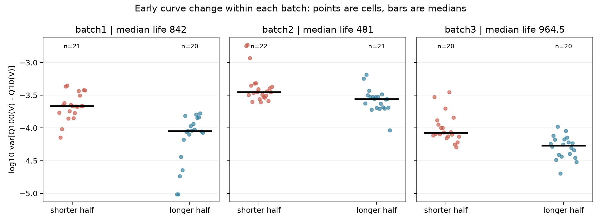

# ESS 배터리 수명 예측

초기 100사이클의 기록만으로 LFP·흑연 배터리 **셀**의 수명을 예측했습니다. 먼저 세 배치의 수명·용량 곡선·충전 조건을 비교하고, 초기 변화가 수명과 가장 일관되게 연결된 `ΔQ(V)`를 핵심 변수로 선택했습니다. 이 변수와 초기 방전 용량(`QD`), 내부저항(`IR`)을 사용한 모델의 Batch 2 오차는 **19.39% MAPE**였습니다. Batch 1 내부 검증보다 오차가 큰 이유도 셀별 예측 결과에서 확인했습니다.

## 프로젝트 개요

| 항목 | 내용 |
|---|---|
| 데이터셋 | MIT-Stanford Battery Dataset, Severson 외(2019)의 LFP·흑연 셀 |
| 학습 데이터 | Batch 1 (`2017-05-12`), 분석 대상 41셀 |
| 필수 평가 데이터 | Batch 2 (`2017-06-30`), 분석 대상 43셀 |
| 추가 평가 데이터 | Batch 3 (`2018-04-12`), 분석 대상 40셀 |
| 태스크 | **회귀**: 처음 100사이클로 `cycle_life` 예측 |
| 목표값 | 방전 용량이 정격 용량의 80%에 도달할 때까지의 사이클 수 |
| 평가지표 | MAPE: 실제 수명에 대한 예측 오차의 비율 |

장·단수명 분류보다 **몇 사이클에 80% 기준에 도달하는지**가 점검 시점을 판단하는 데 직접 연결된다고 보아 회귀를 선택했습니다. 같은 단수명 범주에 들어가는 150사이클과 499사이클도 운영상 같은 시점으로 취급하기 어렵습니다.

과제 예시의 Batch 2 날짜인 `2018-02-20`은 **이번 분석에 사용한 Batch 2 파일이 아닙니다**. 실제 입력 파일은 `2017-06-30_batchdata_updated_struct_errorcorrect.mat`입니다. [원본 파일과 처리 기준](data/README.md)에 세 배치의 파일명과 다운로드 주소를 기록했습니다.

원본은 Batch 1·2·3에 각각 46·48·46셀입니다. 공개 전처리 기준에 따라 수명이 끝나지 않은 Batch 1의 5셀, Batch 1에서 이어 측정해 Batch 2에 중복된 5셀, Batch 3의 노이즈 채널 6셀을 각 분석 집단에서 제외했습니다. Batch 1 첫 5셀의 연속 측정 길이는 **수명 레이블에만** 더했습니다. 최종 분석 대상은 **41·43·40셀**이며, 수명 분포와 모델 평가에서 **셀 하나를 한 행**으로 계산했습니다.

## 파일 구조

```text
├── data/
│   └── README.md                  # 원자료 다운로드 주소·제외 기준
├── DAY1-EDA.ipynb                 # 저장된 EDA 그림·표 열람
├── DAY1-REPORT.md                # 배치별 EDA와 모델 전략
├── DAY2-REPORT.md                # 모델 개발·오류 분석
├── src/
│   ├── day1_eda.py               # 원자료에서 셀·사이클·초기 변수 추출
│   ├── day1_compare.py           # 세 배치 EDA와 그림 생성
│   ├── day2_model_compare.py     # 후보 모델 비교
│   ├── day2_model.py             # 정책별 분할·학습·평가
│   ├── audit_results.py          # 원자료·예측·성능표 검증
│   └── reproduce.py              # 분석과 보고서 재생성
├── results/
│   ├── figures/                  # EDA 그림
│   ├── day2/                     # 분할, 후보 비교, 셀별 예측과 오류
│   └── model_performance.csv      # 제출 형식 성능표
├── requirements.txt
└── README.md
```

위 트리는 주요 진입점입니다. 피처 제거·추가 실험을 포함한 나머지 스크립트도 `src/`에 있습니다. 원본 `.mat` 파일은 용량 때문에 Git에 넣지 않았습니다.

## 환경 설정

Python 3.14에서 실행을 확인했습니다. 원본 파일로 EDA부터 다시 수행하려면 [data/README.md](data/README.md)의 세 `.mat` 파일을 `data/`에 내려받으세요. 원본 세 파일은 약 7.7GB입니다.

```bash
git clone https://github.com/jun394647/ess-battery-cycle-life-mini-project.git
cd ess-battery-cycle-life-mini-project
python3 -m venv .venv
.venv/bin/python -m pip install -r requirements.txt
.venv/bin/python src/reproduce.py
```

원본이 없다면 Git에 포함된 셀 단위 결과로 모델 평가와 PDF를 재생성할 수 있습니다.

```bash
.venv/bin/python src/reproduce.py --from-results
```

이 명령은 원본에서 피처를 다시 뽑지는 않습니다. 원본 대조 결과는 [감사 기록](results/audit_results.json)에, 상세한 실행 순서는 [Day 2 보고서](DAY2-REPORT.md)에 있습니다.

## EDA

### Cycle Life 분포

| 배치 | 평균 | 중앙값 | 수명 범위 | 500사이클 미만 | 1,000사이클 초과 |
|---|---:|---:|---:|---:|---:|
| Batch 1 (41셀) | 921 | 842 | 534–2,237 | 0셀 | 10셀 |
| Batch 2 (43셀) | 473 | 481 | 148–713 | **33셀(77%)** | 0셀 |
| Batch 3 (40셀) | 1,032 | 965 | 541–1,935 | 0셀 | **19셀(48%)** |


**핵심 발견:** Batch 1의 최단 수명은 **534사이클**인데 필수 테스트인 Batch 2는 **33/43셀**이 500사이클 미만입니다. Batch 1만으로 학습한 회귀 모델은 짧은 수명 구간을 외삽해야 합니다. 그래서 전체 MAPE뿐 아니라 **짧은 수명 셀을 얼마나 길게 예측하는지** 따로 확인하기로 했습니다. Batch 2의 148·300·335사이클 셀은 통계적 이상값이지만 유효한 종료 기록이므로 임의로 빼지 않았습니다.

### 열화 곡선과 knee point


셀별 `QD` 곡선은 초기에는 비슷하다가 뒤로 갈수록 감소 시점이 갈렸습니다. 21사이클 이동 중앙값과 두 구간 직선으로 탐색한 knee 중앙값은 Batch 1·2·3에서 **580·381·766사이클**이었습니다. 유효한 곡선에서는 knee 뒤쪽의 용량 감소 기울기가 더 가팔랐습니다.

**핵심 발견:** 수명 차이는 열화가 **언제 가속되는지**와 연결돼 보입니다. 다만 knee는 미래 사이클을 보고 계산한 탐색적 경계입니다. 처음 100사이클로 예측하는 모델에 넣으면 미래 정보가 새므로 입력에서 제외했습니다. 배치별 곡선과 계산 한계는 [Day 1 분석](DAY1-REPORT.md)에 적었습니다.

### ΔQ(V) 곡선과 파생변수

초기 평균 `QD`와 수명의 Spearman 상관은 Batch 1·2·3에서 **+0.19·+0.30·+0.25**였습니다. 처음 용량만으로 수명을 구분하기 어려워, 같은 셀의 공통 전압점에서 **`Qdlin100(V) − Qdlin10(V)`**를 계산했습니다. 이 곡선의 분산에 상용로그를 취한 `delta_q_logvar = log10(var(ΔQ(V)))`가 제가 만든 핵심 파생변수입니다.


이 변수와 수명의 Spearman 상관은 **-0.88·-0.65·-0.76**입니다. 세 배치에서 모두 초기 곡선 변화가 큰 셀일수록 수명이 짧은 방향이었습니다. Batch 2의 원곡선에서는 일부 단수명 셀이 약 3.0V 부근에서 더 크게 내려갔지만 집단 간 곡선은 겹쳤습니다. Batch 1에는 500사이클 미만 셀이 없으므로, 같은 배치에서 절대 기준의 장·단수명 곡선을 직접 비교할 수는 없습니다. 대신 **배치별 수명 중앙값으로 나눈 짧은 절반과 긴 절반**을 비교했고, 세 배치 모두 짧은 절반의 로그 분산 중앙값이 더 높았습니다.



**핵심 발견:** `ΔQ(V)` 변화의 **방향**은 배치마다 유지돼 핵심 입력으로 택했습니다. 그러나 로그 분산의 배치별 중앙값 자체는 **-3.84·-3.52·-4.15**로 이동합니다. 한 배치에서 정한 숫자 기준을 다른 배치에 그대로 적용할 수 있다는 뜻은 아닙니다. 분산은 곡선의 모든 형태를 담지 못하므로 구간별 변화와 PCA 형태 변수도 나중에 시험했습니다.

### 충전 속도(C-rate)와 수명


Batch 1의 반복 정책을 보면 `3.6C(80%)-3.6C`는 **3셀 평균 2,083사이클**, `4.8C(80%)-4.8C`는 **2셀 평균 753사이클**입니다. 반면 후자의 Batch 2 평균은 **3셀 476사이클**이었습니다. Batch 2는 43셀에 정책이 41종류라 정책별 평균 대부분이 셀 하나의 값입니다. 두 단계의 C-rate, 전환 SOC, 배치 조건도 함께 달라집니다.

처음에는 고속 충전이 수명을 줄인다고 생각했지만, 첫 구간 C-rate와 수명의 Spearman 상관은 **-0.49·+0.14·-0.16**으로 배치마다 방향이 같지 않았습니다. 초기 평균 충전 시간의 상관도 **+0.60·+0.04·+0.05**였습니다.

**핵심 발견:** 충전 정책이 중요한 실험 조건이라는 점과 **이 자료에서 정책 숫자만으로 수명을 안정적으로 예측할 수 있는지**는 별도 문제였습니다. 제가 만든 정책 강도 대리변수는 Batch 1에서 `ΔQ(V)` 로그 분산과 Pearson 상관이 **0.96**으로 높았습니다. 따라서 정책표의 값보다 **셀에서 실제로 관측된 초기 곡선 변화**를 우선 입력으로 놓고, 정책 변수의 추가 이득은 모델 비교에서 확인했습니다. 이 비교만으로 C-rate의 인과 효과를 주장하지 않습니다.

### 초기 신호의 상관관계와 중복


| 초기 변수와 수명의 Spearman 상관 | Batch 1 | Batch 2 | Batch 3 |
|---|---:|---:|---:|
| `delta_q_logvar` | **-0.88** | **-0.65** | **-0.76** |
| 초기 평균 `QD` | +0.19 | +0.30 | +0.25 |
| 초기 평균 `IR` | +0.21 | +0.10 | +0.21 |
| 초기 평균 `Tavg` | -0.39 | +0.09 | +0.02 |
| 첫 구간 C-rate | -0.49 | +0.14 | -0.16 |

온도는 배터리 열화에 중요하지만 이 자료의 초기 `Tavg`는 Batch 1 밖에서 수명과의 상관 방향이 유지되지 않았습니다. 히트맵의 **Pearson** 상관과 표의 **Spearman** 상관은 계산 방식이 다릅니다. 정책 강도와 `delta_q_logvar`의 높은 중복도 확인했습니다. 선택한 세 입력에는 분석 셀의 결측이 없었습니다.

**핵심 발견:** 단순 상관이 가장 강한 `ΔQ(V)`를 중심으로 두되, 상관이 약한 `QD`와 `IR`도 **기존 입력을 알고 난 뒤 추가 예측력이 있는지** 모델에서 검증했습니다. EDA만으로 세 변수의 최종 조합을 확정하지 않았습니다.

## Modeling

### 피처 엔지니어링 전략

| 변수 | 계산 시점과 뜻 | 선택 근거 |
|---|---|---|
| `delta_q_logvar` | 10회와 100회의 방전 용량 곡선 차이 분산에 `log10` | 세 배치에서 가장 일관된 수명 관계를 보인 핵심 변수 |
| `early_mean_QD` | 1~100사이클 평균 방전 용량 | `ΔQ(V)`의 변화 폭과 다른 용량 수준 정보인지 제거 실험으로 확인 |
| `early_mean_IR` | 1~100사이클 평균 내부저항 | 단순 상관은 약하지만 기존 두 변수와 겹치지 않는 초기 측정값 후보 |

`QD`를 더하자 2변수 로그 Ridge의 Batch 1 개발용 CV MAPE가 `ΔQ(V)` 단독 **10.08% → 7.59%**로 낮아졌습니다. `IR`까지 더한 모델은 **7.10%**였습니다. 같은 규제 강도에서 `IR`을 추가할 때도 **7.59% → 7.30%**로 낮아져, 개선이 규제 강도 변경만의 결과는 아니었습니다.

`Tavg`를 2변수 모델에 더하면 CV가 **7.59% → 8.07%**로 높아졌고, 정책 강도는 `ΔQ(V)`와 중복됐습니다. 미래 기록인 knee와 전체 수명 이후에만 알 수 있는 값은 입력에서 제외했습니다. 결측 대체와 표준화는 검증 데이터가 섞이지 않도록 **각 학습 폴드 안에서만** 맞췄습니다.

### 모델 선택 및 근거

- **후보 모델:** 중앙값 기준선, 일반·로그 Ridge, Elastic Net, 결정트리, Random Forest, Extra Trees, Gradient Boosting, SVR, KNN 등 **22개 설정**을 같은 Batch 1 개발용 정책별 CV로 비교했습니다.
- **최종 모델:** `delta_q_logvar`, `early_mean_QD`, `early_mean_IR`을 입력으로 하는 **단일 로그 타깃 Ridge 회귀(α=0.1)**입니다. 여러 모델의 예측을 합친 앙상블은 아닙니다.
- **선택 이유:** 셀이 41개로 적고 초기 변수끼리 중복됩니다. 복잡한 모델의 성능을 가정하기보다 규제된 회귀를 기준으로 비교했습니다. 중앙값 기준선은 CV **24.18%**, 일반 Ridge 3변수는 **12.36%**, Random Forest 3변수는 **12.11%**, 선택한 로그 Ridge는 **7.10%**였습니다. 수명이 양수이고 평가가 상대오차인 점도 로그 목표값을 시험한 근거입니다.

`IR`을 추가한 뒤 기존 2변수 모델보다 Batch 1 CV는 **7.59% → 7.10%**, Batch 2는 **24.11% → 19.39%**로 낮아졌습니다. 다만 `IR` 후보는 **이전 Batch 2 성능을 본 뒤** 추가했습니다. 따라서 Batch 2 개선은 사후 결과이며 미접촉 테스트에서 확인된 개선으로 주장하지 않습니다. 추가 후보 중 `ΔQ(V)` 평균절댓값은 내부 CV **6.66%**였지만 분산과 Pearson 상관이 **0.95**여서 중복 위험이 컸습니다. CV 최솟값 하나로 최종 변수를 고르지 않은 이유입니다.

곡선을 10→50회와 50→100회로 나눈 변수는 Batch 1 CV부터 나빠졌습니다. 곡선 형태 PCA 1축은 CV **7.08%**, Batch 2 **19.40%**로 현재 모델과 사실상 같았습니다. 수명의 역수 예측은 CV **6.18%**지만 정책 분리 hold-out **28.34%**, Batch 2 **32.63%**로 불안정했습니다. 계산과 전체 후보 결과는 [Day 2 보고서](DAY2-REPORT.md)와 `results/day2/`에 남겼습니다.

### 데이터 분할과 학습 절차

1. Batch 1 **41셀**을 충전 정책 단위로 개발용 **31셀**과 hold-out **10셀**로 나눴습니다. 두 집합에 같은 정책이 겹치지 않습니다.
2. 개발용 31셀에서 정책별 `GroupKFold(5)`로 후보를 비교했습니다. 아래 표의 **Train (Batch 1 CV)**는 학습 셀의 오차가 아니라 **5개 검증 폴드의 평균 오차**입니다.
3. 선택한 모델을 개발용으로 학습해 hold-out을 확인한 뒤, Batch 1 전체로 다시 학습해 Batch 2 전체를 평가했습니다. Batch 3은 추가 평가입니다.

[분할표](results/day2/batch1_split.csv)와 [모델 코드](src/day2_model.py)에서 실제 셀 배정과 파이프라인을 확인할 수 있습니다. Day 1 사전 비교에는 Batch 1 전체가 쓰였으므로 hold-out도 완전한 미접촉 집합은 아닙니다. Batch 2의 분포와 앞선 모델 결과도 이미 본 상태에서 `IR`을 선택했습니다. 이 선택 이력을 성능 해석에 반영했습니다.

## 성능 결과

| 구분 | MAPE (%) | 비고 |
|---|---:|---|
| Train (Batch 1 CV) | **7.10** | 개발용 31셀, 정책별 5분할 평균 |
| Valid (Batch 1 Hold-out) | **7.15** | 개발용과 정책이 겹치지 않는 10셀 |
| Test (Batch 2) | **19.39** | Batch 1 전체 학습 후 43셀 평가 |
| Gap (Train-Valid) | **+0.06%p** | Valid − Train, 내부 검증 차이 |
| Gap (Valid-Test) | **+12.24%p** | Batch 2 − Valid, 배치 이동 시 오차 증가 |
| Gap (Target-Test) | **+10.29%p** | Batch 2 − 논문 초록의 9.1% |
| Test (Batch 3) | **10.99** | 추가 평가 40셀 |
| Gap (Batch2-Batch3) | **−8.40%p** | Batch 3 − Batch 2 |
| Gap (Target-Test, Batch 3) | **+1.89%p** | Batch 3 − 9.1% |

Batch 2에서 **예측 수명과 실제 수명의 평균 절대 차이(MAE)는 91.25사이클**입니다. 오차의 방향까지 포함한 평균은 **+74.99사이클**로, 전체적으로 실제보다 길게 예측했습니다. MAPE **19.39%**는 이 사이클 차이를 각 셀의 실제 수명으로 나누어 평균한 비율입니다.

Batch 2 오차는 내부 hold-out보다 **12.24%p** 높았습니다. 논문 초록의 **9.1%**보다 **10.29%p** 높지만, 두 수치를 같은 테스트 설계로 읽으면 안 됩니다. [원논문](https://web.mit.edu/braatzgroup/Severson_NatureEnergy_2019.pdf)의 Primary test 전체 셀 MAPE는 표 1에서 Full 모델 **14.1%**, Discharge 모델 **13.0%**입니다. 공개 분할은 Batch 1·2를 섞어 학습·시험으로 나누고, 이 과제는 **Batch 1만 학습 → Batch 2 전체 테스트**입니다. 과제 기준에 맞춘 성능표는 [`results/model_performance.csv`](results/model_performance.csv)에 있습니다.

## 오류 분석


Batch 2의 실제 수명 중앙값은 **481사이클**, 예측 중앙값은 **570사이클**입니다. **43셀 중 37셀**을 실제보다 길게 예측했고, 500사이클 미만 **33셀**은 평균 **78사이클 과대예측**했습니다. 가장 큰 Batch 2 절대오차인 `batch2_020`은 실제 **502사이클**을 **758사이클**로 예측해 **+256사이클** 틀렸습니다. 반대로 Batch 3에서는 1,000사이클 초과 **19셀**을 평균 **177사이클 과소예측**했습니다.

제가 먼저 의심한 원인은 **학습·평가 배치의 수명 범위 차이**입니다. Batch 1에는 534사이클보다 짧은 학습 셀이 없는데 Batch 2의 77%는 500사이클 미만입니다. 초기 `ΔQ(V)`의 배치별 중앙값도 이동합니다. 이는 과대예측과 일치하는 관찰이지만, 충전 조건·실험 시기·측정 시작 조건 중 무엇이 원인인지 이 자료만으로 분리할 수 없습니다.

**개선 방향:** 원곡선의 전압 격자와 측정 시작 조건, 수명 레이블을 먼저 대조하겠습니다. 이후 500사이클 미만 셀이 포함된 새 학습 집단을 확보하고, 새로운 실험 시기의 배치를 평가용으로 **사전에 고정**해 다시 시험하겠습니다. 짧은 수명의 과대예측이 실제 운영에 더 위험하다면 그 구간의 편향도 모델 선택 기준에 넣겠습니다. Batch 2 일부 레이블로 보정해 오차가 줄어든 실험은 있지만 정답을 추가 사용한 사후 분석이므로 **19.39%를 대신하는 테스트 성능으로 쓰지 않았습니다**.

[셀별 예측값](results/day2/cell_predictions.csv), [큰 오차 셀](results/day2/worst_errors.csv), [수명 구간별 오류](results/day2/error_group_summary.csv)에서 계산 근거를 확인할 수 있습니다.

## ESS 도메인 해석

이 모델이 실제 BESS에 적용된다면, 초기 곡선 변화가 큰 셀을 **추가 검사와 추적 관찰의 우선 대상으로 고르는 데** 참고할 수 있겠습니다. 하지만 Batch 2에서 짧은 수명을 길게 예측한 경향이 남아 있으므로 현재 점수로 **팩 교체 시점이나 보증 기간을 결정하기는 어렵습니다**. 제가 중요하게 보는 것은 전체 MAPE를 조금 낮추는 것보다, 위험한 셀의 점검을 늦추는 예측이 얼마나 남는지입니다.

이번 데이터는 통제된 조건에서 시험한 **셀**의 기록입니다. 현장 ESS에는 셀 간 편차, 팩 온도, BMS 제어, 실제 운전 이력이 더해집니다. 따라서 팩에 쓰려면 같은 측정 정의의 초기 기록과 현장 운영 데이터를 연결하고, 새 시기의 셀·팩에서 오차와 과대예측률을 함께 검증해야 합니다. Batch 2의 오차가 보여준 핵심은 **초기 열화 신호를 찾는 일과 다른 배치의 절대 수명을 맞히는 일은 각각 확인해야 한다**는 점입니다.

## 참고문헌

- Severson, K. A. 외(2019). [Data-driven prediction of battery cycle life before capacity degradation](https://doi.org/10.1038/s41560-019-0356-8). *Nature Energy*, 4, 383–391.
- [MIT-Stanford 원자료](https://data.matr.io/1/projects/5c48dd2bc625d700019f3204) 및 [공개 전처리 코드](https://github.com/rdbraatz/data-driven-prediction-of-battery-cycle-life-before-capacity-degradation).
- 상세 EDA·모델 판단과 그래프: [Day 1 보고서](DAY1-REPORT.md), [Day 2 보고서](DAY2-REPORT.md).

## 팀 구성

- **박준형(U015)**: 원자료 확인, 세 배치 EDA, 변수 설계, 모델 비교·개발, Batch 2·3 평가, 오류 분석과 보고서 작성.
